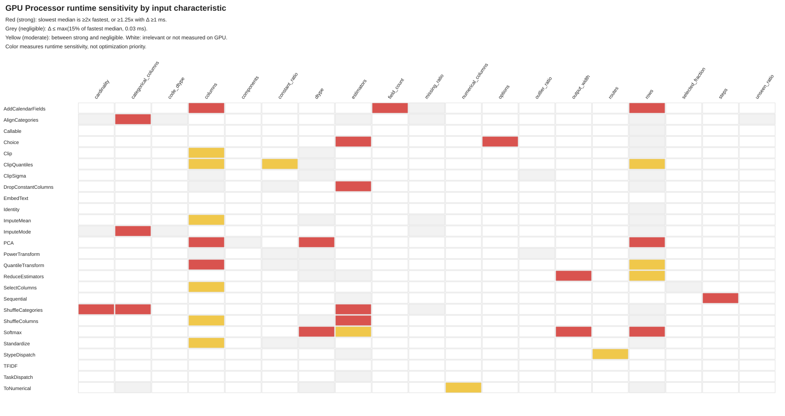
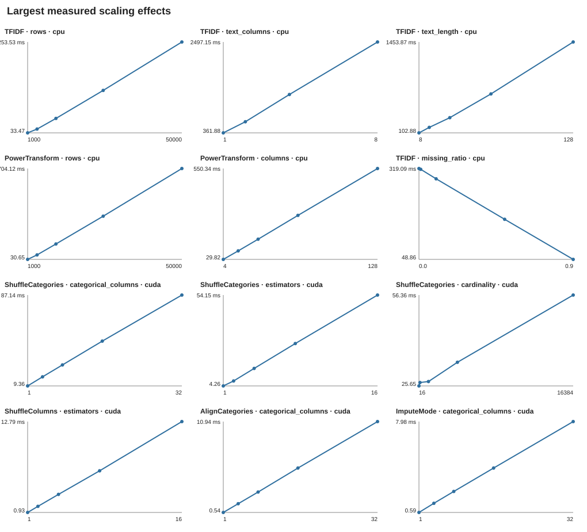

# Processor performance characterization

## Result

The characterization completed without benchmark errors on commit
`6b5deaad15feb0b0f9d4e99b4bc6b99b4298354e`.

- 26 public concrete Processors were characterized independently.
- 181 CPU/GPU characteristic sweeps completed; 11 GPU text/string sweeps were
  skipped because the optional cuDF stack is not installed.
- 65 negligible sweeps stopped after their three pilot points. This avoided
  130 of 810 possible points, or 2,340 timed/warmup calls at the production
  repetition count.
- The strongest practical optimization targets are `ShuffleCategories`,
  `PowerTransform`, CPU `TFIDF`, CPU `AddCalendarFields`, and the per-column
  categorical orchestration shared by `AlignCategories` and `ImputeMode`.
- Missing ratio, outlier ratio, unseen-category ratio, and ordinary code dtype
  are usually negligible. Rows and columns dominate most real data paths.
  Estimators dominate the shuffle Processors but are flat from 1 to 16 when
  `TFIDF` or `AlignCategories` operate on shared ensemble storage.

No production Processor was changed by this work. Estimated benefits below are
optimization ceilings or engineering estimates, not remeasured fixes.

## Methodology

The harness varies one characteristic at a time and constructs all inputs
outside the timed region. Fitted transform-only cases are fitted before timing;
fit benchmarks create a fresh Processor before each timed call. CUDA inputs are
device-resident and each measurement records synchronized wall time, CUDA event
time, host enqueue time, synchronization wait, and peak allocated GPU memory.

| Setting                   | Value                                                   |
| ------------------------- | ------------------------------------------------------- |
| CPU                       | AMD EPYC 7R13, 4 vCPUs, 2 PyTorch threads               |
| GPU                       | NVIDIA L4, 23,659,151,360 bytes, compute capability 8.9 |
| Software                  | PyTorch 2.13.0+cu130, CUDA 13.0                         |
| Repetitions               | 15 measured runs per point, 3 warmups                   |
| Default numerical input   | 10,000 rows × 32 columns, float32                       |
| Default categorical input | 10,000 rows × 8 columns, cardinality 1,024              |
| Default ensemble/output   | 8 estimators, output width 32                           |
| Default text input        | 10,000 rows × 1 column × 32 characters                  |

Each axis starts with its minimum, midpoint, and maximum. It stops there when
the median range is at most `max(15% of the minimum, 0.20 ms CPU / 0.03 ms GPU)`. Material axes are expanded to all five configured points. `p95` is the
interpolated 95th percentile of the 15 synchronized wall times.

The raw measurements, including every median, p95, CUDA timing component, peak
allocation, decision threshold, and early-stop decision, are in
[`results/processor_characterization.json`](results/processor_characterization.json).
The reproducible runner is
[`processor_characterization.py`](processor_characterization.py).

Representative hotspot timings are:

| Processor / varied characteristic          |       CPU median / p95 | GPU median / p95 |
| ------------------------------------------ | ---------------------: | ---------------: |
| `TFIDF`, 8 text columns                    | 2,497.15 / 2,516.92 ms | cuDF unavailable |
| `PowerTransform`, 50k rows × 32 columns    |     704.12 / 712.03 ms | 21.08 / 21.92 ms |
| `AddCalendarFields`, 50k rows × 32 columns |     146.77 / 170.76 ms |   4.05 / 4.08 ms |
| `ShuffleCategories`, 32 columns            |       79.90 / 83.47 ms | 87.14 / 92.15 ms |
| `QuantileTransform`, 128 columns           |     152.76 / 154.59 ms |   2.99 / 3.24 ms |
| `Softmax`, output width 512                |     115.45 / 123.92 ms |   2.89 / 2.91 ms |
| `AlignCategories`, 32 columns              |         7.39 / 7.58 ms | 10.94 / 11.25 ms |
| `ImputeMode`, 32 columns                   |         7.01 / 8.80 ms |   7.98 / 8.25 ms |

## Main findings

| Rank | Opportunity                               | Evidence                                                                                                                                                           | Recommended direction                                                                                               |                                                                            Estimated benefit |
| ---: | ----------------------------------------- | ------------------------------------------------------------------------------------------------------------------------------------------------------------------ | ------------------------------------------------------------------------------------------------------------------- | -------------------------------------------------------------------------------------------: |
|    1 | Batch categorical permutation work        | `ShuffleCategories` reached 106.10 ms CPU and 87.14 ms GPU; GPU time was 99.9% spent before the final sync and scaled with columns, cardinality, and estimators    | Remove per-column/per-estimator Python routing and `.tolist()` materialization; build batched permutation/lookups   |                                         40–70%, about 35–60 ms in the measured wide GPU case |
|    2 | Compile/fuse the fixed Yeo–Johnson search | `PowerTransform` reached 704.12 ms CPU. GPU stayed at 20.1–21.3 ms from 1k to 50k rows because 44 launch-heavy iterations dominate; enqueue was 99.8% of wall time | Cache a compiled fixed-iteration body, with eager fallback and compile-startup excluded from steady state           | 40–55%, about 8–12 ms at 32 columns and roughly 30 ms at the established 90-column E2E scale |
|    3 | Reuse calendar intermediates              | CPU `AddCalendarFields` jumped to 146.77 ms at 50k × 32 and 110.43 ms at 10k × 128; missing ratio was flat                                                         | Compute time-of-day, day count, and civil-date conversion once per transform and reuse across requested fields      |                                               25–50%, about 35–70 ms in the largest CPU case |
|    4 | Native/batched TF-IDF tokenization        | CPU `TFIDF` reached 2.50 s at 8 text columns and 2.25 s at 50k rows; rows, columns, and text length were linear                                                    | Batch columns and replace Python character n-gram construction with a native/vectorized path; retain `max_features` |                                          20–50%, about 0.5–1.25 s in the measured worst case |
|    5 | Batch categorical fit/lookup columns      | `AlignCategories` reached 10.94 ms and `ImputeMode` 7.98 ms on GPU at 32 columns; enqueue was 99.6%/99.5%                                                          | Flatten column/cardinality metadata and issue batched count/search/gather operations                                |                                                 30–50%, about 3–5 ms and 2–4 ms respectively |
|    6 | Tune quantile chunks only after the above | `QuantileTransform` reached 152.76 ms CPU and 2.99 ms GPU at 128 columns; GPU enqueue was 98.4%                                                                    | Compile or coarsen the per-feature-chunk search/interpolation path without changing quantiles                       |                                      20–40%, about 0.6–1.2 ms in the isolated GPU worst case |

### Nsight Systems validation

The three highest-priority GPU orchestration hypotheses were profiled on the
same NVIDIA L4 with Nsight Systems 2026.1.3. Each trace contains three warmups
followed by ten NVTX-marked calls; statistics below are filtered to the outer
Processor range. Nsight increased wall time by 1.78–2.03×, so unprofiled
latencies remain authoritative while profiler call counts and attribution are
used for diagnosis.

| Processor / scenario                        | Unprofiled median | Kernels / call | Summed kernel time / call | CUDA launches / call | Async copies / call | Stream syncs / call |
| ------------------------------------------- | ----------------: | -------------: | ------------------------: | -------------------: | ------------------: | ------------------: |
| `AlignCategories`, 10k × 32, K=1,024        |          10.94 ms |            805 |                   1.79 ms |                  805 |                  32 |                  32 |
| `PowerTransform`, 50k × 32, float32         |          21.08 ms |          2,163 |                   8.80 ms |                2,163 |                   0 |                   0 |
| `ShuffleCategories`, 10k × 32, K=1,024, E=8 |          87.14 ms |          5,904 |                  20.54 ms |                5,904 |               1,312 |                 536 |

The traces confirm:

- `AlignCategories` is dominated by per-column orchestration. Its 32
  device-to-host copies and stream synchronizations match the 32 dynamic
  boolean-indexed vocabulary materializations. Batching columns and avoiding
  dynamic-shape indexing is the relevant optimization.
- `PowerTransform` emits 2,163 kernels for one call. The fixed 44-step search
  expands into repeated small elementwise and reduction kernels, validating
  compile/fusion rather than a data-movement optimization.
- `ShuffleCategories` has the largest avoidable chain. Each call contains 256
  logical radix sorts (8 estimators × 32 columns), represented by 256 instances
  of each radix-sort kernel, plus 528 device-to-host copies. Cache inverse
  permutations first to remove repeated `argsort`; then batch masked remapping
  and category gathers across estimators and columns.

The consolidated raw summary includes the complete CUDA API and kernel tables,
memory-operation tables, profiled samples, and matching unprofiled baselines in
[`results/processor_gpu_profiles.json`](results/processor_gpu_profiles.json).
The reproducible capture target is
[`profile_processor_hotspots.py`](profile_processor_hotspots.py). Binary
`.nsys-rep` traces are not committed. Nsight Systems validates call topology
and timing attribution but does not provide the hardware counters or SM metrics
that would require Nsight Compute.

The highest GPU allocations were `Softmax` at 476.9 MiB (8 × 10k × 512),
`AddCalendarFields` at 218.8 MiB (50k × 32), and `ReduceEstimators` at
184.4 MiB (8 × 10k × 512). These are shape-driven tensor footprints, not
leaks.

## Per-Processor summary and permanent scenarios

`R`, `C`, `K`, `E`, and `W` mean rows, columns, categorical cardinality,
estimators, and output width. Estimated benefit is the practical Processor-only
ceiling at the measured worst case.

| Processor             | Input / dominant scaling                                                                                                                         | Dominant limit                                                           | Frequency / priority                | Estimated benefit and recommendation                                                                   | Permanent scenario                                                 |
| --------------------- | ------------------------------------------------------------------------------------------------------------------------------------------------ | ------------------------------------------------------------------------ | ----------------------------------- | ------------------------------------------------------------------------------------------------------ | ------------------------------------------------------------------ |
| `Identity`            | Any; rows flat, 0.008 ms CPU / 0.040 ms GPU                                                                                                      | Orchestration floor                                                      | High / none                         | None; preserve as the framework floor                                                                  | Baseline `R=10k,C=32,E=8` smoke                                    |
| `Callable`            | Any; wrapper flat, 0.008 / 0.037 ms; callback excluded by identity function                                                                      | Callback-dependent                                                       | Medium / none in wrapper            | None in SDM; benchmark expensive user callback separately                                              | Identity callable at `R=10k,C=32`                                  |
| `Sequential`          | Any; identity-step count linear/sub-linear, 0.30 / 0.41 ms at 16 steps                                                                           | Python/module orchestration                                              | High / low                          | At most 0.2–0.3 ms; avoid deep identity-like chains                                                    | 1, 4, and 16 steps at `E=8`                                        |
| `StypeDispatch`       | All stypes; route count up to 0.54 / 0.70 ms, data size not relevant to identity routes                                                          | Splitting/concatenation orchestration                                    | High / low                          | Less than 0.3 ms; optimize only with evidence from real routes                                         | 1 vs 3 active stypes, `E=8`                                        |
| `TaskDispatch`        | Output; estimator count flat, 0.029 / 0.071 ms                                                                                                   | Route lookup floor                                                       | High / none                         | None                                                                                                   | Classification identity route, `E=1/16`                            |
| `Choice`              | Any; options and selected estimator groups show thresholds, 2.89 / 3.07 ms at 16 identity options                                                | Routing and ensemble materialization                                     | High / medium                       | 1–2 ms by grouping routes without repeated table assembly                                              | `options=1/4/16`, `E=1/8/16`                                       |
| `ToNumerical`         | Categorical + numerical; rows reached only 0.33 / 0.25 ms                                                                                        | Cast/concatenation data movement                                         | High / low                          | Less than 0.2 ms; no special optimization justified                                                    | `R=1k/50k`, categorical/numerical `C=1/32`                         |
| `ShuffleColumns`      | Numerical; scales with `E`, `R`, and `C`; 16.44 / 12.79 ms                                                                                       | Per-estimator allocation and copies                                      | High / medium-high                  | 20–40% (3–6 ms) by batched gather/output allocation reuse                                              | `R=1k/50k`, `C=4/128`, `E=1/8/16`                                  |
| `SelectColumns`       | All stypes; at most 0.24 / 0.28 ms                                                                                                               | Metadata and views                                                       | Medium / low                        | Less than 0.1 ms; retain simple implementation                                                         | `C=4/128`, selected fraction 10%/100%                              |
| `TFIDF`               | Text; rows, text columns, length linear; missing values reduce work; vocabulary input and shared `E=1…16` are flat under the 1,000-feature cap   | Python computation and dense allocations                                 | Low / high when enabled             | 20–50% (0.5–1.25 s) from native/batched n-grams                                                        | `R=1k/10k/50k`, text `C=1/8`, length 8/128, shared `E=1/16`        |
| `EmbedText`           | Text; model calls scale strongly with text columns; 15.34 ms at 8 columns with a zero-cost fake model                                            | Repeated Arrow conversion/model calls                                    | Low / workload-dependent            | Up to ~13 ms wrapper-only by batching columns; real benefit model-dependent                            | Fake model `C=1/8`, dim 64/512; separate real-model case           |
| `Clip`                | Numerical; all tested shapes practically below 0.21 / 0.16 ms                                                                                    | Memory bandwidth/kernel floor                                            | Medium / low                        | Negligible ceiling; no optimization                                                                    | `R=50k,C=128,float32/64` smoke                                     |
| `ClipQuantiles`       | Numerical; CPU rows/columns linear, 71.57 ms at `R=50k`; GPU 0.78 ms                                                                             | Exact quantile computation                                               | Medium / medium on CPU              | 20–50% (14–36 ms CPU) only with a faster exact kernel; sampling changes semantics                      | `R=1k/50k`, `C=4/128`, constant 0%/100%                            |
| `ClipSigma`           | Numerical; CPU rows/columns linear, 11.58 ms; GPU ≤0.77 ms and ratios flat                                                                       | Multiple reduction/mask passes                                           | Medium / medium on CPU              | 20–30% (2–3 ms CPU) from pass fusion                                                                   | `R=1k/50k`, `C=4/128`, outliers 0%/50%                             |
| `ImputeMean`          | Numerical; rows/columns, 2.44 / 0.30 ms; missing ratio flat                                                                                      | Reduction plus memory bandwidth                                          | High / low-medium                   | Less than 1 ms through reduction/replace fusion                                                        | `R=1k/50k`, `C=4/128`, missing 0%/90%                              |
| `PowerTransform`      | Numerical; CPU rows/columns linear and float64 costly; GPU input axes flat around 21 ms                                                          | CPU compute; GPU fixed launch/orchestration chain                        | High / highest                      | 40–55% steady-state from cached compile/fusion                                                         | `R=1k/50k`, `C=4/32/128`, float32/64; report cold and warm compile |
| `QuantileTransform`   | Numerical; CPU rows/columns linear, GPU columns sub-linear; 152.76 / 2.99 ms                                                                     | Sort/search and chunk orchestration                                      | Medium / high                       | 20–40% GPU (0.6–1.2 ms isolated); keep algorithm unchanged                                             | Rows around subsample threshold: 4k/10k/25k/50k; `C=16/32/128`     |
| `Standardize`         | Numerical; CPU rows/columns linear, 5.44 ms; GPU ≤0.36 ms                                                                                        | Reductions and memory bandwidth                                          | High / low-medium                   | 20–30% CPU (1–2 ms) only if fused with adjacent transforms                                             | `R=1k/50k`, `C=4/128`, constant 0%/100%                            |
| `DropConstantColumns` | Numerical; CPU rows linear and column threshold, 4.26 ms; GPU mostly flat with a 0.57 ms single-estimator path                                   | Scan plus host/schema materialization                                    | High / medium                       | Up to 2 ms CPU; investigate the `E=1` GPU threshold before optimizing                                  | `R=1k/50k`, `C=4/128`, `E=1/2/16`, constant 0%/100%                |
| `PCA`                 | Numerical; rows/columns strong, float64 GPU 4.9× float32; component count flat because full SVD is used                                          | Dense SVD compute/synchronization                                        | Low / workload-dependent            | Truncated SVD could save 30–70% (5–10 ms CPU, 2–5 ms GPU) but changes numerics                         | `R=1k/50k`, `C=4/128`, components 2/16/64, float32/64              |
| `AlignCategories`     | Categorical; column count linear, CPU also responds to rows/cardinality; missing/unseen/code dtype and shared `E=1…16` are flat; 7.39 / 10.94 ms | Per-column fit/search/gather orchestration                               | High / high                         | 30–50% (3–5 ms GPU at 32 columns) by batching columns                                                  | `R=1k/50k`, `C=1/8/32`, `K=16/16k`, unseen 0%/90%, shared `E=1/16` |
| `ShuffleCategories`   | Categorical; columns, `K`, and `E` dominate; 106.10 / 87.14 ms                                                                                   | Per-column/per-estimator permutations, allocations, host materialization | High / highest                      | 40–70% (35–60 ms GPU) from batched permutation and lookup                                              | `R=10k/50k`, `C=1/8/32`, `K=16/1k/16k`, `E=1/8/16`                 |
| `ImputeMode`          | Categorical; columns linear, CPU rows threshold; cardinality/missing/code dtype flat; 7.86 / 7.98 ms                                             | Per-column scatter/count orchestration                                   | High / high                         | 30–50% (2–4 ms) by batched counts across columns                                                       | `R=1k/50k`, `C=1/8/32`, `K=16/16k`, missing 0%/90%                 |
| `AddCalendarFields`   | Datetime; rows/columns/field count show thresholds; missing flat; 146.77 / 4.05 ms                                                               | Repeated integer date arithmetic and allocations                         | Medium / high on CPU                | 25–50% (35–70 ms CPU) by reusing shared intermediates                                                  | `R=1k/10k/50k`, `C=4/32/128`, fields 1/2/5                         |
| `ReduceEstimators`    | Numerical output; width strongest, rows moderate; estimator count flat for direct stacked reduction; 5.63 / 0.79 ms                              | Memory bandwidth and output allocation                                   | High / low-medium                   | Less than 2 ms CPU / 0.2 ms GPU; optimize only for very wide outputs                                   | `E=1/8/16`, `R=10k/50k`, `W=2/32/512`                              |
| `Softmax`             | Numerical output; width and rows have thresholds, estimators linear; 115.45 / 2.89 ms at `W=512`                                                 | Compute/memory bandwidth; temporary temperature division                 | High / medium only for wide outputs | Special-case temperature 1 may save 20–40% (23–46 ms CPU worst case); typical small-class gain is tiny | `E=8`, `R=10k/50k`, `W=2/8/32/512`, float32/64                     |

## GPU impact heatmap

This heatmap uses only completed CUDA sweeps. `🔴` means the slowest median is
at least 2× the fastest, or at least 1.25× the fastest with an absolute
difference of at least 1 ms. `⚪` means the difference is at most
`max(15% of the fastest median, 0.03 ms)`. `🟡` covers effects between those
thresholds. Blank cells are irrelevant to that Processor or were not measured
on GPU. Color measures runtime sensitivity, not optimization priority.

| Processor           | Rows | Columns | Value mix | Cardinality | Dtype | Estimators | Output width | Text size | Config count |
| ------------------- | :--: | :-----: | :-------: | :---------: | :---: | :--------: | :----------: | :-------: | :----------: |
| AddCalendarFields   |  🔴  |   🔴    |    ⚪     |             |       |            |              |           |      🔴      |
| AlignCategories     |  ⚪  |   🔴    |    ⚪     |     ⚪      |  ⚪   |     ⚪     |              |           |              |
| Callable            |  ⚪  |         |           |             |       |            |              |           |              |
| Choice              |  ⚪  |         |           |             |       |     🔴     |              |           |      🔴      |
| Clip                |  ⚪  |   🟡    |           |             |  ⚪   |            |              |           |              |
| ClipQuantiles       |  🟡  |   🟡    |    🟡     |             |  ⚪   |            |              |           |              |
| ClipSigma           |  ⚪  |   ⚪    |    ⚪     |             |  ⚪   |            |              |           |              |
| DropConstantColumns |  ⚪  |   ⚪    |    ⚪     |             |       |     🔴     |              |           |              |
| EmbedText           |      |         |           |             |       |            |              |           |              |
| Identity            |  ⚪  |         |           |             |       |            |              |           |              |
| ImputeMean          |  ⚪  |   🟡    |    ⚪     |             |  ⚪   |            |              |           |              |
| ImputeMode          |  ⚪  |   🔴    |    ⚪     |     ⚪      |  ⚪   |            |              |           |              |
| PCA                 |  🔴  |   🔴    |           |             |  🔴   |            |              |           |      ⚪      |
| PowerTransform      |  ⚪  |   ⚪    |    ⚪     |             |  ⚪   |            |              |           |              |
| QuantileTransform   |  🟡  |   🔴    |    ⚪     |             |  ⚪   |            |              |           |              |
| ReduceEstimators    |  🟡  |         |           |             |  ⚪   |     ⚪     |      🔴      |           |              |
| SelectColumns       |      |   🟡    |           |             |       |            |              |           |      ⚪      |
| Sequential          |      |         |           |             |       |     ⚪     |              |           |      🔴      |
| ShuffleCategories   |  ⚪  |   🔴    |    ⚪     |     🔴      |       |     🔴     |              |           |              |
| ShuffleColumns      |  ⚪  |   🟡    |           |             |  ⚪   |     🔴     |              |           |              |
| Softmax             |  🔴  |         |           |             |  🔴   |     🟡     |      🔴      |           |              |
| Standardize         |  ⚪  |   🟡    |    ⚪     |             |  ⚪   |            |              |           |              |
| StypeDispatch       |      |         |           |             |       |     ⚪     |              |           |      🟡      |
| TFIDF               |      |         |           |             |       |            |              |           |              |
| TaskDispatch        |      |         |           |             |       |     ⚪     |              |           |              |
| ToNumerical         |  ⚪  |   🟡    |           |             |  ⚪   |            |              |           |              |

The full GPU-only per-axis heatmap and the six largest numeric scaling effects
per device are also available as SVGs:

## Resource-limit interpretation

- Compute or memory-bandwidth limited: large GPU synchronization wait was seen
  for `Softmax` (90% of wall), `AddCalendarFields` (77%), and
  `ReduceEstimators` (61%). Their runtime and allocation grow with tensor size.
- Launch/orchestration limited: `PowerTransform`, `ShuffleCategories`,
  `ShuffleColumns`, `AlignCategories`, `ImputeMode`, and `QuantileTransform`
  spent 98–100% of synchronized wall time before the final wait. Their Python
  loops, small kernels, table assembly, or column chunks let the GPU catch up
  while work is still being submitted.
- Allocation/data-movement limited: shuffle Processors, `ToNumerical`, text
  output construction, and wide output processors allocate or copy complete
  blocks. Peak GPU allocation tracks `R × C × E` or `R × W × E`.
- CPU compute limited: `TFIDF`, `PowerTransform`, exact quantiles, PCA, and
  calendar conversion scale with their algorithmic work. CPU bandwidth-bound
  elementwise Processors remain small at the tested ranges.

These classifications combine synchronized timing evidence with implementation
inspection. No CPU PMU counters or native-allocation profiler was used, because
those would materially perturb the short Processor calls.

## Limitations

- One-factor-at-a-time sweeps intentionally do not estimate interactions. The
  permanent suite should add `C × K × E` for `ShuffleCategories`, `R × C` for
  calendar/numerical transforms, and `R × W × E` for output Processors.
- GPU text processing and GPU string-category comparison require cuDF and were
  not measured. Integer categorical paths were measured on the L4.
- `EmbedText` uses a deterministic zero-cost embedding module to isolate SDM
  conversion, call-count, and output-allocation overhead. Real model latency
  must be characterized separately.
- Results describe steady-state eager execution on this EPYC/L4 host. A compile
  optimization must report cold compile time, warm steady state, cache behavior,
  and parity separately.
- CPU allocation/bandwidth classifications are implementation-informed rather
  than hardware-counter measurements. GPU peak allocation and enqueue/sync
  decomposition are recorded for every measured point.
- Nsight Systems traces are API/kernel timelines, not Nsight Compute
  hardware-counter profiles.
