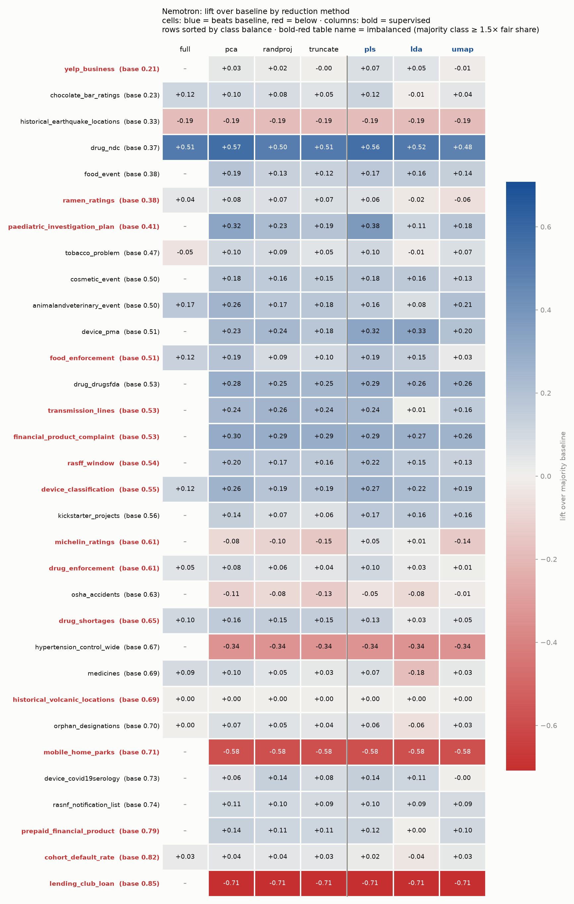

## Experiment details

### Embedding and dimension reduction: 
**The current approach was to concatenate all text rows into a single text col.** That column then gets embedded by the sentence transformer.
After the embedding is reduced and concatenated with the numeric columns into a feature matrix, each CV fold does three TabICL calls:
```
with torch.amp.autocast(device.type, torch.bfloat16):
    tabiclv2.fit(x=x_train, y=y_train)   # 1. load the labeled training rows as context
    logits = tabiclv2.predict(x=x_test)  # 2. classify the test rows against that context
    tabiclv2.clear()                     # 3. free the cached context
preds = logits.argmax(dim=-1)            # class = highest logit
```

**As initial analysis, reduction to 16 and 30 dimensions was performed.**

<details>
<summary>More details</summary>
1. fit(x_train, y_train) — for an in-context model this is not training/gradient updates. It just caches the labeled training rows as the "context" (the in-context examples the model conditions on). No weights change.

2. predict(x_test) — runs the forward pass: the test rows attend to the cached training context and the model emits class logits [n_test, n_classes].

3. clear() — frees that cached context from GPU memory so the next fold/config starts clean.

Then outside TabICL: argmax over the logits → predicted class, compared to y_test for accuracy + macro-F1, averaged over the 5 folds.

</details>

### Scoring:
- Scoring: take argmax and score with accuracy + macro-F1. Targets are LabelEncoder-encoded integer classes.
- The data: STRABLE 32 classification ones ("class" in task).
- The TablCL2 ≤10-class cap: All 32 happened to fit.

### Encoders:
1. MiniLM — CPU-friendly, real-time/edge, short text. Lowest accuracy but smallest footprint.
2. e5-small-v2 — modest accuracy bump over MiniLM with 512-token coverage. Use "query: " / "passage: " prefixes for best results.
3. bge-base-en-v1.5 — best accuracy under 200M params for English-only tasks. Good default for classification/RAG.
4. nemotron-embed-1b-v2 — reach for it when you have long documents (up to 8K tokens), need Matryoshka flexible dims, or are already on NVIDIA infrastructure. Overkill for short tabular text.


| Spec  | all-MiniLM-L6-v2 | e5-small-v2 | bge-base-en-v1.5 |  llama-nemotron-embed-1b-v2 |
| --- | --- | --- | --- | --- |
| Parameters | 22.7M  | ~33M  | 110M | 1B |
| Embed Dim  | 384  | 384  | 786 | 2048 (Matryoshka: 384–2048) |
| Max Tokens | 256 | 512 | 512 | 8192 |
| MTEB Overall | ~56.3 | ~59.0  | 63.55 | ~68+ |
| Speed  | Very Fast | Fast | Modedare | Slow (GPU required) |

`llama-nemotron-embed-1b-v2` performed the best on average so most the analysis below is focused on it as an encoder. 

### Reducers (Unsupervised):
1. PCA
2. Random Projection
3. Matrioshka Truncation

### Reducers (Supervised):
1. PLS 
2. LDA
3. Supervised Umap 

### Summary:



### Code:
1. `text_embed_tabiclv2.py` -> main pipeline. 
2. `list_strable.py` -> find datasets from STRABLE paper that are applicable to our investigation.
3. `run_strable_all.py` -> Combine and run the 1 and 2 above. 
4. `compare_reducers.py` -> Combine output into a unified output. 

### Appendix
### Overall results (all encoders):
| dataset | encoder | reducer | k | acc | macro_f1 | lift | baseline | n_classes |
| --- | --- | --- | --- | --- | --- | --- | --- | --- |
| animalandveterinary_event | nvidia/llama-nemotron-embed-1b-v2 | pls | 16 | 0.6602 | 0.6598 | 0.1584 | 0.5019 | 2 |
| animalandveterinary_event | nvidia/llama-nemotron-embed-1b-v2 | pls | 30 | 0.6171 | 0.617 | 0.1152 | 0.5019 | 2 |
| animalandveterinary_event | nvidia/llama-nemotron-embed-1b-v2 | lda | 16 | 0.5784 | 0.5778 | 0.0766 | 0.5019 | 2 |
| animalandveterinary_event | nvidia/llama-nemotron-embed-1b-v2 | lda | 30 | 0.5784 | 0.5778 | 0.0766 | 0.5019 | 2 |
| animalandveterinary_event | nvidia/llama-nemotron-embed-1b-v2 | umap_sup | 16 | 0.7063 | 0.7049 | 0.2045 | 0.5019 | 2 |
| animalandveterinary_event | nvidia/llama-nemotron-embed-1b-v2 | umap_sup | 30 | 0.7093 | 0.7074 | 0.2074 | 0.5019 | 2 |
| chocolate_bar_ratings | nvidia/llama-nemotron-embed-1b-v2 | pls | 16 | 0.3291 | 0.3264 | 0.1036 | 0.2255 | 5 |
| chocolate_bar_ratings | nvidia/llama-nemotron-embed-1b-v2 | pls | 30 | 0.3449 | 0.3434 | 0.1194 | 0.2255 | 5 |
| chocolate_bar_ratings | nvidia/llama-nemotron-embed-1b-v2 | lda | 16 | 0.2194 | 0.2084 | -0.0061 | 0.2255 | 5 |
| chocolate_bar_ratings | nvidia/llama-nemotron-embed-1b-v2 | lda | 30 | 0.2194 | 0.2084 | -0.0061 | 0.2255 | 5 |
| chocolate_bar_ratings | nvidia/llama-nemotron-embed-1b-v2 | umap_sup | 16 | 0.2675 | 0.2673 | 0.042 | 0.2255 | 5 |
| chocolate_bar_ratings | nvidia/llama-nemotron-embed-1b-v2 | umap_sup | 30 | 0.2617 | 0.2611 | 0.0362 | 0.2255 | 5 |
| cohort_default_rate | nvidia/llama-nemotron-embed-1b-v2 | pls | 16 | 0.8443 | 0.7149 | 0.0194 | 0.8249 | 2 |
| cohort_default_rate | nvidia/llama-nemotron-embed-1b-v2 | pls | 30 | 0.8255 | 0.698 | 0.0006 | 0.8249 | 2 |
| cohort_default_rate | nvidia/llama-nemotron-embed-1b-v2 | lda | 16 | 0.7887 | 0.6585 | -0.0362 | 0.8249 | 2 |
| cohort_default_rate | nvidia/llama-nemotron-embed-1b-v2 | lda | 30 | 0.7887 | 0.6585 | -0.0362 | 0.8249 | 2 |
| cohort_default_rate | nvidia/llama-nemotron-embed-1b-v2 | umap_sup | 16 | 0.8534 | 0.6851 | 0.0285 | 0.8249 | 2 |
| cohort_default_rate | nvidia/llama-nemotron-embed-1b-v2 | umap_sup | 30 | 0.8496 | 0.6871 | 0.0247 | 0.8249 | 2 |
| cosmetic_event | nvidia/llama-nemotron-embed-1b-v2 | pls | 16 | 0.6772 | 0.5905 | 0.1806 | 0.4966 | 3 |
| cosmetic_event | nvidia/llama-nemotron-embed-1b-v2 | pls | 30 | 0.6726 | 0.5985 | 0.176 | 0.4966 | 3 |
| cosmetic_event | nvidia/llama-nemotron-embed-1b-v2 | lda | 16 | 0.6595 | 0.5994 | 0.1629 | 0.4966 | 3 |
| cosmetic_event | nvidia/llama-nemotron-embed-1b-v2 | lda | 30 | 0.6595 | 0.5994 | 0.1629 | 0.4966 | 3 |
| cosmetic_event | nvidia/llama-nemotron-embed-1b-v2 | umap_sup | 16 | 0.6167 | 0.5551 | 0.1201 | 0.4966 | 3 |
| cosmetic_event | nvidia/llama-nemotron-embed-1b-v2 | umap_sup | 30 | 0.6217 | 0.5559 | 0.1251 | 0.4966 | 3 |
| device_classification | nvidia/llama-nemotron-embed-1b-v2 | pls | 16 | 0.8177 | 0.7654 | 0.2666 | 0.5511 | 3 |
| device_classification | nvidia/llama-nemotron-embed-1b-v2 | pls | 30 | 0.8146 | 0.7645 | 0.2636 | 0.5511 | 3 |
| device_classification | nvidia/llama-nemotron-embed-1b-v2 | lda | 16 | 0.7694 | 0.712 | 0.2183 | 0.5511 | 3 |
| device_classification | nvidia/llama-nemotron-embed-1b-v2 | lda | 30 | 0.7694 | 0.712 | 0.2183 | 0.5511 | 3 |
| device_classification | nvidia/llama-nemotron-embed-1b-v2 | umap_sup | 16 | 0.7449 | 0.6484 | 0.1938 | 0.5511 | 3 |
| device_classification | nvidia/llama-nemotron-embed-1b-v2 | umap_sup | 30 | 0.738 | 0.6407 | 0.1869 | 0.5511 | 3 |
| device_covid19serology | nvidia/llama-nemotron-embed-1b-v2 | pls | 16 | 0.8528 | 0.8017 | 0.1255 | 0.7273 | 2 |
| device_covid19serology | nvidia/llama-nemotron-embed-1b-v2 | pls | 30 | 0.8689 | 0.8265 | 0.1417 | 0.7273 | 2 |
| device_covid19serology | nvidia/llama-nemotron-embed-1b-v2 | lda | 16 | 0.8381 | 0.7939 | 0.1108 | 0.7273 | 2 |
| device_covid19serology | nvidia/llama-nemotron-embed-1b-v2 | lda | 30 | 0.8381 | 0.7939 | 0.1108 | 0.7273 | 2 |
| device_covid19serology | nvidia/llama-nemotron-embed-1b-v2 | umap_sup | 16 | 0.7183 | 0.5597 | -0.0089 | 0.7273 | 2 |
| device_covid19serology | nvidia/llama-nemotron-embed-1b-v2 | umap_sup | 30 | 0.7234 | 0.5591 | -0.0039 | 0.7273 | 2 |
| device_pma | nvidia/llama-nemotron-embed-1b-v2 | pls | 16 | 0.8128 | 0.8127 | 0.3022 | 0.5106 | 2 |
| device_pma | nvidia/llama-nemotron-embed-1b-v2 | pls | 30 | 0.8327 | 0.8326 | 0.3221 | 0.5106 | 2 |
| device_pma | nvidia/llama-nemotron-embed-1b-v2 | lda | 16 | 0.8416 | 0.8416 | 0.331 | 0.5106 | 2 |
| device_pma | nvidia/llama-nemotron-embed-1b-v2 | lda | 30 | 0.8416 | 0.8416 | 0.331 | 0.5106 | 2 |
| device_pma | nvidia/llama-nemotron-embed-1b-v2 | umap_sup | 16 | 0.7046 | 0.7037 | 0.194 | 0.5106 | 2 |
| device_pma | nvidia/llama-nemotron-embed-1b-v2 | umap_sup | 30 | 0.7079 | 0.707 | 0.1973 | 0.5106 | 2 |
| drug_drugsfda | nvidia/llama-nemotron-embed-1b-v2 | pls | 16 | 0.8121 | 0.8121 | 0.2871 | 0.525 | 2 |
| drug_drugsfda | nvidia/llama-nemotron-embed-1b-v2 | pls | 30 | 0.8156 | 0.8154 | 0.2906 | 0.525 | 2 |
| drug_drugsfda | nvidia/llama-nemotron-embed-1b-v2 | lda | 16 | 0.7817 | 0.7808 | 0.2567 | 0.525 | 2 |
| drug_drugsfda | nvidia/llama-nemotron-embed-1b-v2 | lda | 30 | 0.7817 | 0.7808 | 0.2567 | 0.525 | 2 |
| drug_drugsfda | nvidia/llama-nemotron-embed-1b-v2 | umap_sup | 16 | 0.7854 | 0.7851 | 0.2604 | 0.525 | 2 |
| drug_drugsfda | nvidia/llama-nemotron-embed-1b-v2 | umap_sup | 30 | 0.7854 | 0.7853 | 0.2604 | 0.525 | 2 |
| drug_enforcement | nvidia/llama-nemotron-embed-1b-v2 | pls | 16 | 0.7167 | 0.6617 | 0.103 | 0.6137 | 3 |
| drug_enforcement | nvidia/llama-nemotron-embed-1b-v2 | pls | 30 | 0.7134 | 0.6638 | 0.0997 | 0.6137 | 3 |
| drug_enforcement | nvidia/llama-nemotron-embed-1b-v2 | lda | 16 | 0.6405 | 0.594 | 0.0269 | 0.6137 | 3 |
| drug_enforcement | nvidia/llama-nemotron-embed-1b-v2 | lda | 30 | 0.6405 | 0.594 | 0.0269 | 0.6137 | 3 |
| drug_enforcement | nvidia/llama-nemotron-embed-1b-v2 | umap_sup | 16 | 0.6234 | 0.5003 | 0.0098 | 0.6137 | 3 |
| drug_enforcement | nvidia/llama-nemotron-embed-1b-v2 | umap_sup | 30 | 0.6223 | 0.4939 | 0.0087 | 0.6137 | 3 |
| drug_ndc | nvidia/llama-nemotron-embed-1b-v2 | pls | 16 | 0.9228 | 0.8982 | 0.5541 | 0.3688 | 4 |
| drug_ndc | nvidia/llama-nemotron-embed-1b-v2 | pls | 30 | 0.9297 | 0.909 | 0.5609 | 0.3688 | 4 |
| drug_ndc | nvidia/llama-nemotron-embed-1b-v2 | lda | 16 | 0.8885 | 0.8476 | 0.5197 | 0.3688 | 4 |
| drug_ndc | nvidia/llama-nemotron-embed-1b-v2 | lda | 30 | 0.8885 | 0.8476 | 0.5197 | 0.3688 | 4 |
| drug_ndc | nvidia/llama-nemotron-embed-1b-v2 | umap_sup | 16 | 0.8405 | 0.7812 | 0.4717 | 0.3688 | 4 |
| drug_ndc | nvidia/llama-nemotron-embed-1b-v2 | umap_sup | 30 | 0.8491 | 0.7991 | 0.4803 | 0.3688 | 4 |
| drug_shortages | nvidia/llama-nemotron-embed-1b-v2 | pls | 16 | 0.7746 | 0.6952 | 0.128 | 0.6466 | 3 |
| drug_shortages | nvidia/llama-nemotron-embed-1b-v2 | pls | 30 | 0.7424 | 0.6578 | 0.0958 | 0.6466 | 3 |
| drug_shortages | nvidia/llama-nemotron-embed-1b-v2 | lda | 16 | 0.672 | 0.5928 | 0.0254 | 0.6466 | 3 |
| drug_shortages | nvidia/llama-nemotron-embed-1b-v2 | lda | 30 | 0.672 | 0.5928 | 0.0254 | 0.6466 | 3 |
| drug_shortages | nvidia/llama-nemotron-embed-1b-v2 | umap_sup | 16 | 0.6958 | 0.5853 | 0.0492 | 0.6466 | 3 |
| drug_shortages | nvidia/llama-nemotron-embed-1b-v2 | umap_sup | 30 | 0.6941 | 0.6031 | 0.0475 | 0.6466 | 3 |
| financial_product_complaint | nvidia/llama-nemotron-embed-1b-v2 | pls | 16 | 0.8148 | 0.5544 | 0.2864 | 0.5284 | 4 |
| financial_product_complaint | nvidia/llama-nemotron-embed-1b-v2 | pls | 30 | 0.8147 | 0.6276 | 0.2862 | 0.5284 | 4 |
| financial_product_complaint | nvidia/llama-nemotron-embed-1b-v2 | lda | 16 | 0.8009 | 0.6168 | 0.2725 | 0.5284 | 4 |
| financial_product_complaint | nvidia/llama-nemotron-embed-1b-v2 | lda | 30 | 0.8009 | 0.6168 | 0.2725 | 0.5284 | 4 |
| financial_product_complaint | nvidia/llama-nemotron-embed-1b-v2 | umap_sup | 16 | 0.7907 | 0.4641 | 0.2623 | 0.5284 | 4 |
| financial_product_complaint | nvidia/llama-nemotron-embed-1b-v2 | umap_sup | 30 | 0.7932 | 0.4751 | 0.2648 | 0.5284 | 4 |
| food_enforcement | nvidia/llama-nemotron-embed-1b-v2 | pls | 16 | 0.7009 | 0.5875 | 0.1902 | 0.5107 | 3 |
| food_enforcement | nvidia/llama-nemotron-embed-1b-v2 | pls | 30 | 0.6955 | 0.5933 | 0.1847 | 0.5107 | 3 |
| food_enforcement | nvidia/llama-nemotron-embed-1b-v2 | lda | 16 | 0.6582 | 0.565 | 0.1475 | 0.5107 | 3 |
| food_enforcement | nvidia/llama-nemotron-embed-1b-v2 | lda | 30 | 0.6582 | 0.565 | 0.1475 | 0.5107 | 3 |
| food_enforcement | nvidia/llama-nemotron-embed-1b-v2 | umap_sup | 16 | 0.5371 | 0.4793 | 0.0264 | 0.5107 | 3 |
| food_enforcement | nvidia/llama-nemotron-embed-1b-v2 | umap_sup | 30 | 0.5205 | 0.4699 | 0.0098 | 0.5107 | 3 |
| food_event | nvidia/llama-nemotron-embed-1b-v2 | pls | 16 | 0.5494 | 0.5465 | 0.1702 | 0.3792 | 3 |
| food_event | nvidia/llama-nemotron-embed-1b-v2 | pls | 30 | 0.5482 | 0.5449 | 0.169 | 0.3792 | 3 |
| food_event | nvidia/llama-nemotron-embed-1b-v2 | lda | 16 | 0.5384 | 0.5355 | 0.1592 | 0.3792 | 3 |
| food_event | nvidia/llama-nemotron-embed-1b-v2 | lda | 30 | 0.5384 | 0.5355 | 0.1592 | 0.3792 | 3 |
| food_event | nvidia/llama-nemotron-embed-1b-v2 | umap_sup | 16 | 0.5179 | 0.517 | 0.1387 | 0.3792 | 3 |
| food_event | nvidia/llama-nemotron-embed-1b-v2 | umap_sup | 30 | 0.5181 | 0.5173 | 0.1389 | 0.3792 | 3 |
| historical_earthquake_locations | nvidia/llama-nemotron-embed-1b-v2 | pls | 16 | 0.1411 | 0.0618 | -0.1858 | 0.3269 | 4 |
| historical_earthquake_locations | nvidia/llama-nemotron-embed-1b-v2 | pls | 30 | 0.1411 | 0.0618 | -0.1858 | 0.3269 | 4 |
| historical_earthquake_locations | nvidia/llama-nemotron-embed-1b-v2 | lda | 16 | 0.1411 | 0.0618 | -0.1858 | 0.3269 | 4 |
| historical_earthquake_locations | nvidia/llama-nemotron-embed-1b-v2 | lda | 30 | 0.1411 | 0.0618 | -0.1858 | 0.3269 | 4 |
| historical_earthquake_locations | nvidia/llama-nemotron-embed-1b-v2 | umap_sup | 16 | 0.1411 | 0.0618 | -0.1858 | 0.3269 | 4 |
| historical_earthquake_locations | nvidia/llama-nemotron-embed-1b-v2 | umap_sup | 30 | 0.1411 | 0.0618 | -0.1858 | 0.3269 | 4 |
| historical_volcanic_locations | nvidia/llama-nemotron-embed-1b-v2 | pls | 16 | 0.6915 | 0.2044 | 0.0 | 0.6915 | 4 |
| historical_volcanic_locations | nvidia/llama-nemotron-embed-1b-v2 | pls | 30 | 0.6915 | 0.2044 | 0.0 | 0.6915 | 4 |
| historical_volcanic_locations | nvidia/llama-nemotron-embed-1b-v2 | lda | 16 | 0.6915 | 0.2044 | 0.0 | 0.6915 | 4 |
| historical_volcanic_locations | nvidia/llama-nemotron-embed-1b-v2 | lda | 30 | 0.6915 | 0.2044 | 0.0 | 0.6915 | 4 |
| historical_volcanic_locations | nvidia/llama-nemotron-embed-1b-v2 | umap_sup | 16 | 0.6915 | 0.2044 | 0.0 | 0.6915 | 4 |
| historical_volcanic_locations | nvidia/llama-nemotron-embed-1b-v2 | umap_sup | 30 | 0.6915 | 0.2044 | 0.0 | 0.6915 | 4 |
| hypertension_control_wide | nvidia/llama-nemotron-embed-1b-v2 | pls | 16 | 0.3316 | 0.249 | -0.3368 | 0.6684 | 2 |
| hypertension_control_wide | nvidia/llama-nemotron-embed-1b-v2 | pls | 30 | 0.3316 | 0.249 | -0.3368 | 0.6684 | 2 |
| hypertension_control_wide | nvidia/llama-nemotron-embed-1b-v2 | lda | 16 | 0.3316 | 0.249 | -0.3368 | 0.6684 | 2 |
| hypertension_control_wide | nvidia/llama-nemotron-embed-1b-v2 | lda | 30 | 0.3316 | 0.249 | -0.3368 | 0.6684 | 2 |
| hypertension_control_wide | nvidia/llama-nemotron-embed-1b-v2 | umap_sup | 16 | 0.3316 | 0.249 | -0.3368 | 0.6684 | 2 |
| hypertension_control_wide | nvidia/llama-nemotron-embed-1b-v2 | umap_sup | 30 | 0.3316 | 0.249 | -0.3368 | 0.6684 | 2 |
| kickstarter_projects | nvidia/llama-nemotron-embed-1b-v2 | pls | 16 | 0.735 | 0.7302 | 0.1703 | 0.5646 | 2 |
| kickstarter_projects | nvidia/llama-nemotron-embed-1b-v2 | pls | 30 | 0.7354 | 0.7311 | 0.1708 | 0.5646 | 2 |
| kickstarter_projects | nvidia/llama-nemotron-embed-1b-v2 | lda | 16 | 0.7269 | 0.7229 | 0.1623 | 0.5646 | 2 |
| kickstarter_projects | nvidia/llama-nemotron-embed-1b-v2 | lda | 30 | 0.7269 | 0.7229 | 0.1623 | 0.5646 | 2 |
| kickstarter_projects | nvidia/llama-nemotron-embed-1b-v2 | umap_sup | 16 | 0.7225 | 0.72 | 0.1579 | 0.5646 | 2 |
| kickstarter_projects | nvidia/llama-nemotron-embed-1b-v2 | umap_sup | 30 | 0.7214 | 0.7191 | 0.1567 | 0.5646 | 2 |
| lending_club_loan | nvidia/llama-nemotron-embed-1b-v2 | pls | 16 | 0.1459 | 0.1273 | -0.7083 | 0.8541 | 2 |
| lending_club_loan | nvidia/llama-nemotron-embed-1b-v2 | pls | 30 | 0.1459 | 0.1273 | -0.7083 | 0.8541 | 2 |
| lending_club_loan | nvidia/llama-nemotron-embed-1b-v2 | lda | 16 | 0.1459 | 0.1273 | -0.7083 | 0.8541 | 2 |
| lending_club_loan | nvidia/llama-nemotron-embed-1b-v2 | lda | 30 | 0.1459 | 0.1273 | -0.7083 | 0.8541 | 2 |
| lending_club_loan | nvidia/llama-nemotron-embed-1b-v2 | umap_sup | 16 | 0.1459 | 0.1273 | -0.7083 | 0.8541 | 2 |
| lending_club_loan | nvidia/llama-nemotron-embed-1b-v2 | umap_sup | 30 | 0.1459 | 0.1273 | -0.7083 | 0.8541 | 2 |
| medicines | nvidia/llama-nemotron-embed-1b-v2 | pls | 16 | 0.7569 | 0.7167 | 0.0703 | 0.6866 | 2 |
| medicines | nvidia/llama-nemotron-embed-1b-v2 | pls | 30 | 0.7304 | 0.6931 | 0.0438 | 0.6866 | 2 |
| medicines | nvidia/llama-nemotron-embed-1b-v2 | lda | 16 | 0.5064 | 0.4885 | -0.1802 | 0.6866 | 2 |
| medicines | nvidia/llama-nemotron-embed-1b-v2 | lda | 30 | 0.5064 | 0.4885 | -0.1802 | 0.6866 | 2 |
| medicines | nvidia/llama-nemotron-embed-1b-v2 | umap_sup | 16 | 0.7163 | 0.6741 | 0.0297 | 0.6866 | 2 |
| medicines | nvidia/llama-nemotron-embed-1b-v2 | umap_sup | 30 | 0.7167 | 0.6732 | 0.0301 | 0.6866 | 2 |
| michelin_ratings | nvidia/llama-nemotron-embed-1b-v2 | pls | 16 | 0.6633 | 0.3893 | 0.0499 | 0.6134 | 5 |
| michelin_ratings | nvidia/llama-nemotron-embed-1b-v2 | pls | 30 | 0.659 | 0.3987 | 0.0456 | 0.6134 | 5 |
| michelin_ratings | nvidia/llama-nemotron-embed-1b-v2 | lda | 16 | 0.6279 | 0.3966 | 0.0145 | 0.6134 | 5 |
| michelin_ratings | nvidia/llama-nemotron-embed-1b-v2 | lda | 30 | 0.6279 | 0.3966 | 0.0145 | 0.6134 | 5 |
| michelin_ratings | nvidia/llama-nemotron-embed-1b-v2 | umap_sup | 16 | 0.4753 | 0.2536 | -0.1381 | 0.6134 | 5 |
| michelin_ratings | nvidia/llama-nemotron-embed-1b-v2 | umap_sup | 30 | 0.4666 | 0.2489 | -0.1468 | 0.6134 | 5 |
| mobile_home_parks | nvidia/llama-nemotron-embed-1b-v2 | pls | 16 | 0.1268 | 0.075 | -0.5845 | 0.7113 | 3 |
| mobile_home_parks | nvidia/llama-nemotron-embed-1b-v2 | pls | 30 | 0.1268 | 0.075 | -0.5845 | 0.7113 | 3 |
| mobile_home_parks | nvidia/llama-nemotron-embed-1b-v2 | lda | 16 | 0.1268 | 0.075 | -0.5845 | 0.7113 | 3 |
| mobile_home_parks | nvidia/llama-nemotron-embed-1b-v2 | lda | 30 | 0.1268 | 0.075 | -0.5845 | 0.7113 | 3 |
| mobile_home_parks | nvidia/llama-nemotron-embed-1b-v2 | umap_sup | 16 | 0.1268 | 0.075 | -0.5845 | 0.7113 | 3 |
| mobile_home_parks | nvidia/llama-nemotron-embed-1b-v2 | umap_sup | 30 | 0.1268 | 0.075 | -0.5845 | 0.7113 | 3 |
| orphan_designations | nvidia/llama-nemotron-embed-1b-v2 | pls | 16 | 0.7635 | 0.7171 | 0.0645 | 0.699 | 2 |
| orphan_designations | nvidia/llama-nemotron-embed-1b-v2 | pls | 30 | 0.7376 | 0.6922 | 0.0386 | 0.699 | 2 |
| orphan_designations | nvidia/llama-nemotron-embed-1b-v2 | lda | 16 | 0.6406 | 0.609 | -0.0584 | 0.699 | 2 |
| orphan_designations | nvidia/llama-nemotron-embed-1b-v2 | lda | 30 | 0.6406 | 0.609 | -0.0584 | 0.699 | 2 |
| orphan_designations | nvidia/llama-nemotron-embed-1b-v2 | umap_sup | 16 | 0.7324 | 0.6311 | 0.0334 | 0.699 | 2 |
| orphan_designations | nvidia/llama-nemotron-embed-1b-v2 | umap_sup | 30 | 0.7249 | 0.6564 | 0.026 | 0.699 | 2 |
| osha_accidents | nvidia/llama-nemotron-embed-1b-v2 | pls | 16 | 0.5793 | 0.5311 | -0.0495 | 0.6288 | 2 |
| osha_accidents | nvidia/llama-nemotron-embed-1b-v2 | pls | 30 | 0.5622 | 0.5273 | -0.0666 | 0.6288 | 2 |
| osha_accidents | nvidia/llama-nemotron-embed-1b-v2 | lda | 16 | 0.5492 | 0.5277 | -0.0796 | 0.6288 | 2 |
| osha_accidents | nvidia/llama-nemotron-embed-1b-v2 | lda | 30 | 0.5492 | 0.5277 | -0.0796 | 0.6288 | 2 |
| osha_accidents | nvidia/llama-nemotron-embed-1b-v2 | umap_sup | 16 | 0.6167 | 0.5145 | -0.0122 | 0.6288 | 2 |
| osha_accidents | nvidia/llama-nemotron-embed-1b-v2 | umap_sup | 30 | 0.6177 | 0.514 | -0.0111 | 0.6288 | 2 |
| paediatric_investigation_plan | nvidia/llama-nemotron-embed-1b-v2 | pls | 16 | 0.7824 | 0.6326 | 0.3747 | 0.4077 | 4 |
| paediatric_investigation_plan | nvidia/llama-nemotron-embed-1b-v2 | pls | 30 | 0.7827 | 0.6366 | 0.375 | 0.4077 | 4 |
| paediatric_investigation_plan | nvidia/llama-nemotron-embed-1b-v2 | lda | 16 | 0.52 | 0.4376 | 0.1122 | 0.4077 | 4 |
| paediatric_investigation_plan | nvidia/llama-nemotron-embed-1b-v2 | lda | 30 | 0.52 | 0.4376 | 0.1122 | 0.4077 | 4 |
| paediatric_investigation_plan | nvidia/llama-nemotron-embed-1b-v2 | umap_sup | 16 | 0.5887 | 0.4719 | 0.181 | 0.4077 | 4 |
| paediatric_investigation_plan | nvidia/llama-nemotron-embed-1b-v2 | umap_sup | 30 | 0.5864 | 0.4704 | 0.1787 | 0.4077 | 4 |
| prepaid_financial_product | nvidia/llama-nemotron-embed-1b-v2 | pls | 16 | 0.9122 | 0.8602 | 0.1211 | 0.7911 | 2 |
| prepaid_financial_product | nvidia/llama-nemotron-embed-1b-v2 | pls | 30 | 0.9047 | 0.8513 | 0.1136 | 0.7911 | 2 |
| prepaid_financial_product | nvidia/llama-nemotron-embed-1b-v2 | lda | 16 | 0.7911 | 0.4417 | 0.0 | 0.7911 | 2 |
| prepaid_financial_product | nvidia/llama-nemotron-embed-1b-v2 | lda | 30 | 0.7911 | 0.4417 | 0.0 | 0.7911 | 2 |
| prepaid_financial_product | nvidia/llama-nemotron-embed-1b-v2 | umap_sup | 16 | 0.8918 | 0.8258 | 0.1007 | 0.7911 | 2 |
| prepaid_financial_product | nvidia/llama-nemotron-embed-1b-v2 | umap_sup | 30 | 0.8906 | 0.8238 | 0.0995 | 0.7911 | 2 |
| ramen_ratings | nvidia/llama-nemotron-embed-1b-v2 | pls | 16 | 0.4375 | 0.2568 | 0.0555 | 0.3819 | 6 |
| ramen_ratings | nvidia/llama-nemotron-embed-1b-v2 | pls | 30 | 0.4171 | 0.2788 | 0.0352 | 0.3819 | 6 |
| ramen_ratings | nvidia/llama-nemotron-embed-1b-v2 | lda | 16 | 0.3578 | 0.2679 | -0.0242 | 0.3819 | 6 |
| ramen_ratings | nvidia/llama-nemotron-embed-1b-v2 | lda | 30 | 0.3578 | 0.2679 | -0.0242 | 0.3819 | 6 |
| ramen_ratings | nvidia/llama-nemotron-embed-1b-v2 | umap_sup | 16 | 0.324 | 0.2403 | -0.0579 | 0.3819 | 6 |
| ramen_ratings | nvidia/llama-nemotron-embed-1b-v2 | umap_sup | 30 | 0.2986 | 0.2191 | -0.0833 | 0.3819 | 6 |
| rasff_window | nvidia/llama-nemotron-embed-1b-v2 | pls | 16 | 0.7593 | 0.5611 | 0.2151 | 0.5442 | 6 |
| rasff_window | nvidia/llama-nemotron-embed-1b-v2 | pls | 30 | 0.7681 | 0.5843 | 0.2239 | 0.5442 | 6 |
| rasff_window | nvidia/llama-nemotron-embed-1b-v2 | lda | 16 | 0.6992 | 0.5256 | 0.155 | 0.5442 | 6 |
| rasff_window | nvidia/llama-nemotron-embed-1b-v2 | lda | 30 | 0.6992 | 0.5256 | 0.155 | 0.5442 | 6 |
| rasff_window | nvidia/llama-nemotron-embed-1b-v2 | umap_sup | 16 | 0.6708 | 0.4561 | 0.1266 | 0.5442 | 6 |
| rasff_window | nvidia/llama-nemotron-embed-1b-v2 | umap_sup | 30 | 0.6738 | 0.4653 | 0.1296 | 0.5442 | 6 |
| rasnf_notification_list | nvidia/llama-nemotron-embed-1b-v2 | pls | 16 | 0.8422 | 0.7751 | 0.1005 | 0.7418 | 2 |
| rasnf_notification_list | nvidia/llama-nemotron-embed-1b-v2 | pls | 30 | 0.8403 | 0.7752 | 0.0986 | 0.7418 | 2 |
| rasnf_notification_list | nvidia/llama-nemotron-embed-1b-v2 | lda | 16 | 0.827 | 0.7616 | 0.0852 | 0.7418 | 2 |
| rasnf_notification_list | nvidia/llama-nemotron-embed-1b-v2 | lda | 30 | 0.827 | 0.7616 | 0.0852 | 0.7418 | 2 |
| rasnf_notification_list | nvidia/llama-nemotron-embed-1b-v2 | umap_sup | 16 | 0.8305 | 0.7498 | 0.0887 | 0.7418 | 2 |
| rasnf_notification_list | nvidia/llama-nemotron-embed-1b-v2 | umap_sup | 30 | 0.8314 | 0.749 | 0.0897 | 0.7418 | 2 |
| tobacco_problem | nvidia/llama-nemotron-embed-1b-v2 | pls | 16 | 0.5746 | 0.5681 | 0.102 | 0.4726 | 3 |
| tobacco_problem | nvidia/llama-nemotron-embed-1b-v2 | pls | 30 | 0.5502 | 0.5578 | 0.0776 | 0.4726 | 3 |
| tobacco_problem | nvidia/llama-nemotron-embed-1b-v2 | lda | 16 | 0.4612 | 0.4534 | -0.0114 | 0.4726 | 3 |
| tobacco_problem | nvidia/llama-nemotron-embed-1b-v2 | lda | 30 | 0.4612 | 0.4534 | -0.0114 | 0.4726 | 3 |
| tobacco_problem | nvidia/llama-nemotron-embed-1b-v2 | umap_sup | 16 | 0.5403 | 0.5375 | 0.0677 | 0.4726 | 3 |
| tobacco_problem | nvidia/llama-nemotron-embed-1b-v2 | umap_sup | 30 | 0.5274 | 0.5288 | 0.0548 | 0.4726 | 3 |
| transmission_lines | nvidia/llama-nemotron-embed-1b-v2 | pls | 16 | 0.7663 | 0.7151 | 0.2391 | 0.5272 | 3 |
| transmission_lines | nvidia/llama-nemotron-embed-1b-v2 | pls | 30 | 0.7674 | 0.7146 | 0.2402 | 0.5272 | 3 |
| transmission_lines | nvidia/llama-nemotron-embed-1b-v2 | lda | 16 | 0.5379 | 0.3352 | 0.0107 | 0.5272 | 3 |
| transmission_lines | nvidia/llama-nemotron-embed-1b-v2 | lda | 30 | 0.5379 | 0.3352 | 0.0107 | 0.5272 | 3 |
| transmission_lines | nvidia/llama-nemotron-embed-1b-v2 | umap_sup | 16 | 0.6793 | 0.6143 | 0.1521 | 0.5272 | 3 |
| transmission_lines | nvidia/llama-nemotron-embed-1b-v2 | umap_sup | 30 | 0.6828 | 0.6184 | 0.1556 | 0.5272 | 3 |
| yelp_business | nvidia/llama-nemotron-embed-1b-v2 | pls | 16 | 0.2763 | 0.2388 | 0.0692 | 0.2071 | 9 |
| yelp_business | nvidia/llama-nemotron-embed-1b-v2 | pls | 30 | 0.2685 | 0.2421 | 0.0615 | 0.2071 | 9 |
| yelp_business | nvidia/llama-nemotron-embed-1b-v2 | lda | 16 | 0.2542 | 0.2323 | 0.0471 | 0.2071 | 9 |
| yelp_business | nvidia/llama-nemotron-embed-1b-v2 | lda | 30 | 0.2542 | 0.2323 | 0.0471 | 0.2071 | 9 |
| yelp_business | nvidia/llama-nemotron-embed-1b-v2 | umap_sup | 16 | 0.1927 | 0.1748 | -0.0144 | 0.2071 | 9 |
| yelp_business | nvidia/llama-nemotron-embed-1b-v2 | umap_sup | 30 | 0.1833 | 0.1663 | -0.0238 | 0.2071 | 9 |
| animalandveterinary_event | all-MiniLM-L6-v2 | none | 384 | 0.6684 | 0.6608 | 0.1665 | 0.5019 | 2 |
| animalandveterinary_event | all-MiniLM-L6-v2 | pca | 16 | 0.7361 | 0.7357 | 0.2342 | 0.5019 | 2 |
| animalandveterinary_event | all-MiniLM-L6-v2 | pca | 30 | 0.7368 | 0.7365 | 0.2349 | 0.5019 | 2 |
| animalandveterinary_event | all-MiniLM-L6-v2 | randproj | 16 | 0.687 | 0.6866 | 0.1851 | 0.5019 | 2 |
| animalandveterinary_event | all-MiniLM-L6-v2 | randproj | 30 | 0.7063 | 0.7059 | 0.2045 | 0.5019 | 2 |
| animalandveterinary_event | all-MiniLM-L6-v2 | truncate | 16 | 0.6914 | 0.691 | 0.1896 | 0.5019 | 2 |
| animalandveterinary_event | all-MiniLM-L6-v2 | truncate | 30 | 0.7078 | 0.7074 | 0.2059 | 0.5019 | 2 |
| animalandveterinary_event | intfloat/e5-small-v2 | none | 384 | 0.6714 | 0.6681 | 0.1695 | 0.5019 | 2 |
| animalandveterinary_event | intfloat/e5-small-v2 | pca | 16 | 0.6714 | 0.6707 | 0.1695 | 0.5019 | 2 |
| animalandveterinary_event | intfloat/e5-small-v2 | pca | 30 | 0.713 | 0.7122 | 0.2112 | 0.5019 | 2 |
| animalandveterinary_event | intfloat/e5-small-v2 | randproj | 16 | 0.6372 | 0.6366 | 0.1353 | 0.5019 | 2 |
| animalandveterinary_event | intfloat/e5-small-v2 | randproj | 30 | 0.6461 | 0.6455 | 0.1442 | 0.5019 | 2 |
| animalandveterinary_event | intfloat/e5-small-v2 | truncate | 16 | 0.5896 | 0.5857 | 0.0877 | 0.5019 | 2 |
| animalandveterinary_event | intfloat/e5-small-v2 | truncate | 30 | 0.6558 | 0.6543 | 0.1539 | 0.5019 | 2 |
| animalandveterinary_event | BAAI/bge-base-en-v1.5 | none | 768 | 0.6238 | 0.6136 | 0.1219 | 0.5019 | 2 |
| animalandveterinary_event | BAAI/bge-base-en-v1.5 | pca | 16 | 0.7063 | 0.7055 | 0.2045 | 0.5019 | 2 |
| animalandveterinary_event | BAAI/bge-base-en-v1.5 | pca | 30 | 0.7338 | 0.7331 | 0.232 | 0.5019 | 2 |
| animalandveterinary_event | BAAI/bge-base-en-v1.5 | randproj | 16 | 0.6743 | 0.6739 | 0.1725 | 0.5019 | 2 |
| animalandveterinary_event | BAAI/bge-base-en-v1.5 | randproj | 30 | 0.6818 | 0.6811 | 0.1799 | 0.5019 | 2 |
| animalandveterinary_event | BAAI/bge-base-en-v1.5 | truncate | 16 | 0.6275 | 0.6263 | 0.1257 | 0.5019 | 2 |
| animalandveterinary_event | BAAI/bge-base-en-v1.5 | truncate | 30 | 0.6714 | 0.6708 | 0.1695 | 0.5019 | 2 |
| animalandveterinary_event | nvidia/llama-nemotron-embed-1b-v2 | none | 2048 | 0.6699 | 0.6601 | 0.168 | 0.5019 | 2 |
| animalandveterinary_event | nvidia/llama-nemotron-embed-1b-v2 | pca | 16 | 0.7524 | 0.7518 | 0.2506 | 0.5019 | 2 |
| animalandveterinary_event | nvidia/llama-nemotron-embed-1b-v2 | pca | 30 | 0.7576 | 0.7569 | 0.2558 | 0.5019 | 2 |
| animalandveterinary_event | nvidia/llama-nemotron-embed-1b-v2 | randproj | 16 | 0.6312 | 0.63 | 0.1294 | 0.5019 | 2 |
| animalandveterinary_event | nvidia/llama-nemotron-embed-1b-v2 | randproj | 30 | 0.6736 | 0.6731 | 0.1717 | 0.5019 | 2 |
| animalandveterinary_event | nvidia/llama-nemotron-embed-1b-v2 | truncate | 16 | 0.6461 | 0.6448 | 0.1442 | 0.5019 | 2 |
| animalandveterinary_event | nvidia/llama-nemotron-embed-1b-v2 | truncate | 30 | 0.6796 | 0.6789 | 0.1777 | 0.5019 | 2 |
| chocolate_bar_ratings | all-MiniLM-L6-v2 | none | 384 | 0.2521 | 0.2156 | 0.0265 | 0.2255 | 5 |
| chocolate_bar_ratings | all-MiniLM-L6-v2 | pca | 16 | 0.2582 | 0.2121 | 0.0326 | 0.2255 | 5 |
| chocolate_bar_ratings | all-MiniLM-L6-v2 | pca | 30 | 0.2617 | 0.1989 | 0.0362 | 0.2255 | 5 |
| chocolate_bar_ratings | all-MiniLM-L6-v2 | randproj | 16 | 0.2553 | 0.1968 | 0.0298 | 0.2255 | 5 |
| chocolate_bar_ratings | all-MiniLM-L6-v2 | randproj | 30 | 0.2585 | 0.1934 | 0.033 | 0.2255 | 5 |
| chocolate_bar_ratings | all-MiniLM-L6-v2 | truncate | 16 | 0.2693 | 0.1777 | 0.0437 | 0.2255 | 5 |
| chocolate_bar_ratings | all-MiniLM-L6-v2 | truncate | 30 | 0.2786 | 0.1856 | 0.0531 | 0.2255 | 5 |
| chocolate_bar_ratings | intfloat/e5-small-v2 | none | 384 | 0.3091 | 0.2962 | 0.0835 | 0.2255 | 5 |
| chocolate_bar_ratings | intfloat/e5-small-v2 | pca | 16 | 0.2829 | 0.2283 | 0.0574 | 0.2255 | 5 |
| chocolate_bar_ratings | intfloat/e5-small-v2 | pca | 30 | 0.3091 | 0.2549 | 0.0835 | 0.2255 | 5 |
| chocolate_bar_ratings | intfloat/e5-small-v2 | randproj | 16 | 0.2291 | 0.1561 | 0.0036 | 0.2255 | 5 |
| chocolate_bar_ratings | intfloat/e5-small-v2 | randproj | 30 | 0.2696 | 0.2293 | 0.0441 | 0.2255 | 5 |
| chocolate_bar_ratings | intfloat/e5-small-v2 | truncate | 16 | 0.2435 | 0.1609 | 0.0179 | 0.2255 | 5 |
| chocolate_bar_ratings | intfloat/e5-small-v2 | truncate | 30 | 0.256 | 0.1826 | 0.0305 | 0.2255 | 5 |
| chocolate_bar_ratings | BAAI/bge-base-en-v1.5 | none | 768 | 0.284 | 0.2766 | 0.0584 | 0.2255 | 5 |
| chocolate_bar_ratings | BAAI/bge-base-en-v1.5 | pca | 16 | 0.2664 | 0.222 | 0.0409 | 0.2255 | 5 |
| chocolate_bar_ratings | BAAI/bge-base-en-v1.5 | pca | 30 | 0.2746 | 0.2288 | 0.0491 | 0.2255 | 5 |
| chocolate_bar_ratings | BAAI/bge-base-en-v1.5 | randproj | 16 | 0.2402 | 0.1811 | 0.0147 | 0.2255 | 5 |
| chocolate_bar_ratings | BAAI/bge-base-en-v1.5 | randproj | 30 | 0.2492 | 0.1917 | 0.0237 | 0.2255 | 5 |
| chocolate_bar_ratings | BAAI/bge-base-en-v1.5 | truncate | 16 | 0.247 | 0.1604 | 0.0215 | 0.2255 | 5 |
| chocolate_bar_ratings | BAAI/bge-base-en-v1.5 | truncate | 30 | 0.2553 | 0.1762 | 0.0298 | 0.2255 | 5 |
| chocolate_bar_ratings | nvidia/llama-nemotron-embed-1b-v2 | none | 2048 | 0.341 | 0.3325 | 0.1154 | 0.2255 | 5 |
| chocolate_bar_ratings | nvidia/llama-nemotron-embed-1b-v2 | pca | 16 | 0.2997 | 0.2486 | 0.0742 | 0.2255 | 5 |
| chocolate_bar_ratings | nvidia/llama-nemotron-embed-1b-v2 | pca | 30 | 0.3245 | 0.2792 | 0.099 | 0.2255 | 5 |
| chocolate_bar_ratings | nvidia/llama-nemotron-embed-1b-v2 | randproj | 16 | 0.2772 | 0.205 | 0.0516 | 0.2255 | 5 |
| chocolate_bar_ratings | nvidia/llama-nemotron-embed-1b-v2 | randproj | 30 | 0.3069 | 0.2626 | 0.0814 | 0.2255 | 5 |
| chocolate_bar_ratings | nvidia/llama-nemotron-embed-1b-v2 | truncate | 16 | 0.2632 | 0.194 | 0.0376 | 0.2255 | 5 |
| chocolate_bar_ratings | nvidia/llama-nemotron-embed-1b-v2 | truncate | 30 | 0.2797 | 0.2063 | 0.0541 | 0.2255 | 5 |
| cohort_default_rate | all-MiniLM-L6-v2 | none | 384 | 0.7564 | 0.6078 | -0.0685 | 0.8249 | 2 |
| cohort_default_rate | all-MiniLM-L6-v2 | pca | 16 | 0.8466 | 0.6874 | 0.0217 | 0.8249 | 2 |
| cohort_default_rate | all-MiniLM-L6-v2 | pca | 30 | 0.8415 | 0.6933 | 0.0166 | 0.8249 | 2 |
| cohort_default_rate | all-MiniLM-L6-v2 | randproj | 16 | 0.8636 | 0.6941 | 0.0387 | 0.8249 | 2 |
| cohort_default_rate | all-MiniLM-L6-v2 | randproj | 30 | 0.8623 | 0.7001 | 0.0374 | 0.8249 | 2 |
| cohort_default_rate | all-MiniLM-L6-v2 | truncate | 16 | 0.8553 | 0.6876 | 0.0304 | 0.8249 | 2 |
| cohort_default_rate | all-MiniLM-L6-v2 | truncate | 30 | 0.8438 | 0.6905 | 0.0189 | 0.8249 | 2 |
| cohort_default_rate | intfloat/e5-small-v2 | none | 384 | 0.8598 | 0.7068 | 0.0349 | 0.8249 | 2 |
| cohort_default_rate | intfloat/e5-small-v2 | pca | 16 | 0.8509 | 0.6987 | 0.026 | 0.8249 | 2 |
| cohort_default_rate | intfloat/e5-small-v2 | pca | 30 | 0.8585 | 0.693 | 0.0336 | 0.8249 | 2 |
| cohort_default_rate | intfloat/e5-small-v2 | randproj | 16 | 0.8647 | 0.6871 | 0.0398 | 0.8249 | 2 |
| cohort_default_rate | intfloat/e5-small-v2 | randproj | 30 | 0.8615 | 0.6795 | 0.0366 | 0.8249 | 2 |
| cohort_default_rate | intfloat/e5-small-v2 | truncate | 16 | 0.8526 | 0.678 | 0.0277 | 0.8249 | 2 |
| cohort_default_rate | intfloat/e5-small-v2 | truncate | 30 | 0.8368 | 0.6852 | 0.0119 | 0.8249 | 2 |
| cohort_default_rate | BAAI/bge-base-en-v1.5 | none | 768 | 0.8445 | 0.677 | 0.0196 | 0.8249 | 2 |
| cohort_default_rate | BAAI/bge-base-en-v1.5 | pca | 16 | 0.8572 | 0.7138 | 0.0323 | 0.8249 | 2 |
| cohort_default_rate | BAAI/bge-base-en-v1.5 | pca | 30 | 0.8591 | 0.7142 | 0.0343 | 0.8249 | 2 |
| cohort_default_rate | BAAI/bge-base-en-v1.5 | randproj | 16 | 0.8623 | 0.6886 | 0.0374 | 0.8249 | 2 |
| cohort_default_rate | BAAI/bge-base-en-v1.5 | randproj | 30 | 0.8645 | 0.7001 | 0.0396 | 0.8249 | 2 |
| cohort_default_rate | BAAI/bge-base-en-v1.5 | truncate | 16 | 0.8151 | 0.6615 | -0.0098 | 0.8249 | 2 |
| cohort_default_rate | BAAI/bge-base-en-v1.5 | truncate | 30 | 0.8432 | 0.6776 | 0.0183 | 0.8249 | 2 |
| cohort_default_rate | nvidia/llama-nemotron-embed-1b-v2 | none | 2048 | 0.8523 | 0.6973 | 0.0274 | 0.8249 | 2 |
| cohort_default_rate | nvidia/llama-nemotron-embed-1b-v2 | pca | 16 | 0.8679 | 0.7321 | 0.043 | 0.8249 | 2 |
| cohort_default_rate | nvidia/llama-nemotron-embed-1b-v2 | pca | 30 | 0.8617 | 0.7263 | 0.0368 | 0.8249 | 2 |
| cohort_default_rate | nvidia/llama-nemotron-embed-1b-v2 | randproj | 16 | 0.8626 | 0.6878 | 0.0377 | 0.8249 | 2 |
| cohort_default_rate | nvidia/llama-nemotron-embed-1b-v2 | randproj | 30 | 0.867 | 0.7087 | 0.0421 | 0.8249 | 2 |
| cohort_default_rate | nvidia/llama-nemotron-embed-1b-v2 | truncate | 16 | 0.8596 | 0.685 | 0.0347 | 0.8249 | 2 |
| cohort_default_rate | nvidia/llama-nemotron-embed-1b-v2 | truncate | 30 | 0.8596 | 0.6899 | 0.0347 | 0.8249 | 2 |
| device_classification | all-MiniLM-L6-v2 | none | 384 | 0.5767 | 0.5406 | 0.0256 | 0.5511 | 3 |
| device_classification | all-MiniLM-L6-v2 | pca | 16 | 0.7895 | 0.7172 | 0.2384 | 0.5511 | 3 |
| device_classification | all-MiniLM-L6-v2 | pca | 30 | 0.8195 | 0.7572 | 0.2685 | 0.5511 | 3 |
| device_classification | all-MiniLM-L6-v2 | randproj | 16 | 0.7266 | 0.5877 | 0.1756 | 0.5511 | 3 |
| device_classification | all-MiniLM-L6-v2 | randproj | 30 | 0.7792 | 0.6842 | 0.2281 | 0.5511 | 3 |
| device_classification | all-MiniLM-L6-v2 | truncate | 16 | 0.7223 | 0.6248 | 0.1713 | 0.5511 | 3 |
| device_classification | all-MiniLM-L6-v2 | truncate | 30 | 0.7688 | 0.6915 | 0.2177 | 0.5511 | 3 |
| device_classification | intfloat/e5-small-v2 | none | 384 | 0.7582 | 0.7009 | 0.2071 | 0.5511 | 3 |
| device_classification | intfloat/e5-small-v2 | pca | 16 | 0.758 | 0.6432 | 0.207 | 0.5511 | 3 |
| device_classification | intfloat/e5-small-v2 | pca | 30 | 0.7878 | 0.6909 | 0.2367 | 0.5511 | 3 |
| device_classification | intfloat/e5-small-v2 | randproj | 16 | 0.6588 | 0.5054 | 0.1078 | 0.5511 | 3 |
| device_classification | intfloat/e5-small-v2 | randproj | 30 | 0.7285 | 0.6265 | 0.1774 | 0.5511 | 3 |
| device_classification | intfloat/e5-small-v2 | truncate | 16 | 0.6398 | 0.493 | 0.0888 | 0.5511 | 3 |
| device_classification | intfloat/e5-small-v2 | truncate | 30 | 0.7171 | 0.6129 | 0.1661 | 0.5511 | 3 |
| device_classification | BAAI/bge-base-en-v1.5 | none | 768 | 0.6567 | 0.6221 | 0.1056 | 0.5511 | 3 |
| device_classification | BAAI/bge-base-en-v1.5 | pca | 16 | 0.7864 | 0.7179 | 0.2354 | 0.5511 | 3 |
| device_classification | BAAI/bge-base-en-v1.5 | pca | 30 | 0.8129 | 0.7519 | 0.2619 | 0.5511 | 3 |
| device_classification | BAAI/bge-base-en-v1.5 | randproj | 16 | 0.6871 | 0.5275 | 0.136 | 0.5511 | 3 |
| device_classification | BAAI/bge-base-en-v1.5 | randproj | 30 | 0.7585 | 0.6657 | 0.2075 | 0.5511 | 3 |
| device_classification | BAAI/bge-base-en-v1.5 | truncate | 16 | 0.6849 | 0.5422 | 0.1339 | 0.5511 | 3 |
| device_classification | BAAI/bge-base-en-v1.5 | truncate | 30 | 0.7577 | 0.6639 | 0.2067 | 0.5511 | 3 |
| device_classification | nvidia/llama-nemotron-embed-1b-v2 | none | 2048 | 0.6673 | 0.6197 | 0.1162 | 0.5511 | 3 |
| device_classification | nvidia/llama-nemotron-embed-1b-v2 | pca | 16 | 0.7748 | 0.7162 | 0.2237 | 0.5511 | 3 |
| device_classification | nvidia/llama-nemotron-embed-1b-v2 | pca | 30 | 0.8113 | 0.7586 | 0.2602 | 0.5511 | 3 |
| device_classification | nvidia/llama-nemotron-embed-1b-v2 | randproj | 16 | 0.6846 | 0.5312 | 0.1335 | 0.5511 | 3 |
| device_classification | nvidia/llama-nemotron-embed-1b-v2 | randproj | 30 | 0.7383 | 0.6404 | 0.1872 | 0.5511 | 3 |
| device_classification | nvidia/llama-nemotron-embed-1b-v2 | truncate | 16 | 0.6723 | 0.5485 | 0.1213 | 0.5511 | 3 |
| device_classification | nvidia/llama-nemotron-embed-1b-v2 | truncate | 30 | 0.7438 | 0.6541 | 0.1927 | 0.5511 | 3 |
| drug_enforcement | all-MiniLM-L6-v2 | none | 384 | 0.5193 | 0.4919 | -0.0944 | 0.6137 | 3 |
| drug_enforcement | all-MiniLM-L6-v2 | pca | 16 | 0.6643 | 0.5167 | 0.0506 | 0.6137 | 3 |
| drug_enforcement | all-MiniLM-L6-v2 | pca | 30 | 0.6816 | 0.5589 | 0.0679 | 0.6137 | 3 |
| drug_enforcement | all-MiniLM-L6-v2 | randproj | 16 | 0.6428 | 0.4231 | 0.0291 | 0.6137 | 3 |
| drug_enforcement | all-MiniLM-L6-v2 | randproj | 30 | 0.6636 | 0.5105 | 0.05 | 0.6137 | 3 |
| drug_enforcement | all-MiniLM-L6-v2 | truncate | 16 | 0.647 | 0.4173 | 0.0333 | 0.6137 | 3 |
| drug_enforcement | all-MiniLM-L6-v2 | truncate | 30 | 0.6574 | 0.481 | 0.0437 | 0.6137 | 3 |
| drug_enforcement | intfloat/e5-small-v2 | none | 384 | 0.623 | 0.5644 | 0.0093 | 0.6137 | 3 |
| drug_enforcement | intfloat/e5-small-v2 | pca | 16 | 0.6681 | 0.4971 | 0.0544 | 0.6137 | 3 |
| drug_enforcement | intfloat/e5-small-v2 | pca | 30 | 0.6756 | 0.5231 | 0.0619 | 0.6137 | 3 |
| drug_enforcement | intfloat/e5-small-v2 | randproj | 16 | 0.6383 | 0.3876 | 0.0246 | 0.6137 | 3 |
| drug_enforcement | intfloat/e5-small-v2 | randproj | 30 | 0.6474 | 0.4579 | 0.0337 | 0.6137 | 3 |
| drug_enforcement | intfloat/e5-small-v2 | truncate | 16 | 0.635 | 0.3794 | 0.0213 | 0.6137 | 3 |
| drug_enforcement | intfloat/e5-small-v2 | truncate | 30 | 0.6425 | 0.429 | 0.0289 | 0.6137 | 3 |
| drug_enforcement | BAAI/bge-base-en-v1.5 | none | 768 | 0.5466 | 0.5179 | -0.067 | 0.6137 | 3 |
| drug_enforcement | BAAI/bge-base-en-v1.5 | pca | 16 | 0.661 | 0.4917 | 0.0473 | 0.6137 | 3 |
| drug_enforcement | BAAI/bge-base-en-v1.5 | pca | 30 | 0.6705 | 0.5177 | 0.0568 | 0.6137 | 3 |
| drug_enforcement | BAAI/bge-base-en-v1.5 | randproj | 16 | 0.6374 | 0.388 | 0.0238 | 0.6137 | 3 |
| drug_enforcement | BAAI/bge-base-en-v1.5 | randproj | 30 | 0.6563 | 0.4635 | 0.0426 | 0.6137 | 3 |
| drug_enforcement | BAAI/bge-base-en-v1.5 | truncate | 16 | 0.6363 | 0.3931 | 0.0226 | 0.6137 | 3 |
| drug_enforcement | BAAI/bge-base-en-v1.5 | truncate | 30 | 0.6528 | 0.4571 | 0.0391 | 0.6137 | 3 |
| drug_enforcement | nvidia/llama-nemotron-embed-1b-v2 | none | 2048 | 0.6601 | 0.5491 | 0.0464 | 0.6137 | 3 |
| drug_enforcement | nvidia/llama-nemotron-embed-1b-v2 | pca | 16 | 0.6847 | 0.562 | 0.071 | 0.6137 | 3 |
| drug_enforcement | nvidia/llama-nemotron-embed-1b-v2 | pca | 30 | 0.6974 | 0.5921 | 0.0837 | 0.6137 | 3 |
| drug_enforcement | nvidia/llama-nemotron-embed-1b-v2 | randproj | 16 | 0.639 | 0.4146 | 0.0253 | 0.6137 | 3 |
| drug_enforcement | nvidia/llama-nemotron-embed-1b-v2 | randproj | 30 | 0.6703 | 0.5277 | 0.0566 | 0.6137 | 3 |
| drug_enforcement | nvidia/llama-nemotron-embed-1b-v2 | truncate | 16 | 0.6403 | 0.4218 | 0.0266 | 0.6137 | 3 |
| drug_enforcement | nvidia/llama-nemotron-embed-1b-v2 | truncate | 30 | 0.6568 | 0.4776 | 0.0431 | 0.6137 | 3 |
| drug_ndc | all-MiniLM-L6-v2 | none | 384 | 0.8936 | 0.8717 | 0.5248 | 0.3688 | 4 |
| drug_ndc | all-MiniLM-L6-v2 | pca | 16 | 0.8593 | 0.806 | 0.4906 | 0.3688 | 4 |
| drug_ndc | all-MiniLM-L6-v2 | pca | 30 | 0.9004 | 0.8594 | 0.5316 | 0.3688 | 4 |
| drug_ndc | all-MiniLM-L6-v2 | randproj | 16 | 0.7975 | 0.7348 | 0.4287 | 0.3688 | 4 |
| drug_ndc | all-MiniLM-L6-v2 | randproj | 30 | 0.8696 | 0.8305 | 0.5008 | 0.3688 | 4 |
| drug_ndc | all-MiniLM-L6-v2 | truncate | 16 | 0.7667 | 0.6741 | 0.3979 | 0.3688 | 4 |
| drug_ndc | all-MiniLM-L6-v2 | truncate | 30 | 0.8405 | 0.7852 | 0.4717 | 0.3688 | 4 |
| drug_ndc | intfloat/e5-small-v2 | none | 384 | 0.9177 | 0.8821 | 0.549 | 0.3688 | 4 |
| drug_ndc | intfloat/e5-small-v2 | pca | 16 | 0.8868 | 0.8298 | 0.518 | 0.3688 | 4 |
| drug_ndc | intfloat/e5-small-v2 | pca | 30 | 0.9229 | 0.8824 | 0.5541 | 0.3688 | 4 |
| drug_ndc | intfloat/e5-small-v2 | randproj | 16 | 0.7513 | 0.6561 | 0.3825 | 0.3688 | 4 |
| drug_ndc | intfloat/e5-small-v2 | randproj | 30 | 0.8766 | 0.8391 | 0.5078 | 0.3688 | 4 |
| drug_ndc | intfloat/e5-small-v2 | truncate | 16 | 0.7787 | 0.7399 | 0.4099 | 0.3688 | 4 |
| drug_ndc | intfloat/e5-small-v2 | truncate | 30 | 0.8594 | 0.8039 | 0.4906 | 0.3688 | 4 |
| drug_ndc | BAAI/bge-base-en-v1.5 | none | 768 | 0.9417 | 0.9191 | 0.573 | 0.3688 | 4 |
| drug_ndc | BAAI/bge-base-en-v1.5 | pca | 16 | 0.9177 | 0.8964 | 0.5489 | 0.3688 | 4 |
| drug_ndc | BAAI/bge-base-en-v1.5 | pca | 30 | 0.952 | 0.9248 | 0.5832 | 0.3688 | 4 |
| drug_ndc | BAAI/bge-base-en-v1.5 | randproj | 16 | 0.8199 | 0.7698 | 0.4511 | 0.3688 | 4 |
| drug_ndc | BAAI/bge-base-en-v1.5 | randproj | 30 | 0.9057 | 0.8738 | 0.537 | 0.3688 | 4 |
| drug_ndc | BAAI/bge-base-en-v1.5 | truncate | 16 | 0.7839 | 0.7426 | 0.4151 | 0.3688 | 4 |
| drug_ndc | BAAI/bge-base-en-v1.5 | truncate | 30 | 0.8645 | 0.8237 | 0.4957 | 0.3688 | 4 |
| drug_ndc | nvidia/llama-nemotron-embed-1b-v2 | none | 2048 | 0.88 | 0.8486 | 0.5112 | 0.3688 | 4 |
| drug_ndc | nvidia/llama-nemotron-embed-1b-v2 | pca | 16 | 0.9194 | 0.8881 | 0.5506 | 0.3688 | 4 |
| drug_ndc | nvidia/llama-nemotron-embed-1b-v2 | pca | 30 | 0.9365 | 0.9079 | 0.5677 | 0.3688 | 4 |
| drug_ndc | nvidia/llama-nemotron-embed-1b-v2 | randproj | 16 | 0.7907 | 0.7537 | 0.4219 | 0.3688 | 4 |
| drug_ndc | nvidia/llama-nemotron-embed-1b-v2 | randproj | 30 | 0.8713 | 0.8461 | 0.5026 | 0.3688 | 4 |
| drug_ndc | nvidia/llama-nemotron-embed-1b-v2 | truncate | 16 | 0.801 | 0.7703 | 0.4323 | 0.3688 | 4 |
| drug_ndc | nvidia/llama-nemotron-embed-1b-v2 | truncate | 30 | 0.8816 | 0.8659 | 0.5128 | 0.3688 | 4 |
| drug_shortages | all-MiniLM-L6-v2 | none | 384 | 0.5703 | 0.5113 | -0.0763 | 0.6466 | 3 |
| drug_shortages | all-MiniLM-L6-v2 | pca | 16 | 0.7958 | 0.7159 | 0.1492 | 0.6466 | 3 |
| drug_shortages | all-MiniLM-L6-v2 | pca | 30 | 0.8059 | 0.7263 | 0.1593 | 0.6466 | 3 |
| drug_shortages | all-MiniLM-L6-v2 | randproj | 16 | 0.8025 | 0.7229 | 0.1559 | 0.6466 | 3 |
| drug_shortages | all-MiniLM-L6-v2 | randproj | 30 | 0.8017 | 0.7243 | 0.1551 | 0.6466 | 3 |
| drug_shortages | all-MiniLM-L6-v2 | truncate | 16 | 0.7907 | 0.7042 | 0.1441 | 0.6466 | 3 |
| drug_shortages | all-MiniLM-L6-v2 | truncate | 30 | 0.8 | 0.713 | 0.1534 | 0.6466 | 3 |
| drug_shortages | intfloat/e5-small-v2 | none | 384 | 0.7314 | 0.5856 | 0.0847 | 0.6466 | 3 |
| drug_shortages | intfloat/e5-small-v2 | pca | 16 | 0.7966 | 0.7181 | 0.15 | 0.6466 | 3 |
| drug_shortages | intfloat/e5-small-v2 | pca | 30 | 0.8 | 0.7175 | 0.1534 | 0.6466 | 3 |
| drug_shortages | intfloat/e5-small-v2 | randproj | 16 | 0.789 | 0.7055 | 0.1424 | 0.6466 | 3 |
| drug_shortages | intfloat/e5-small-v2 | randproj | 30 | 0.7958 | 0.7145 | 0.1492 | 0.6466 | 3 |
| drug_shortages | intfloat/e5-small-v2 | truncate | 16 | 0.7898 | 0.7066 | 0.1432 | 0.6466 | 3 |
| drug_shortages | intfloat/e5-small-v2 | truncate | 30 | 0.7924 | 0.7098 | 0.1458 | 0.6466 | 3 |
| drug_shortages | BAAI/bge-base-en-v1.5 | none | 768 | 0.7678 | 0.648 | 0.1212 | 0.6466 | 3 |
| drug_shortages | BAAI/bge-base-en-v1.5 | pca | 16 | 0.7975 | 0.7202 | 0.1508 | 0.6466 | 3 |
| drug_shortages | BAAI/bge-base-en-v1.5 | pca | 30 | 0.8025 | 0.7212 | 0.1559 | 0.6466 | 3 |
| drug_shortages | BAAI/bge-base-en-v1.5 | randproj | 16 | 0.7992 | 0.7233 | 0.1525 | 0.6466 | 3 |
| drug_shortages | BAAI/bge-base-en-v1.5 | randproj | 30 | 0.8076 | 0.7308 | 0.161 | 0.6466 | 3 |
| drug_shortages | BAAI/bge-base-en-v1.5 | truncate | 16 | 0.7873 | 0.6973 | 0.1407 | 0.6466 | 3 |
| drug_shortages | BAAI/bge-base-en-v1.5 | truncate | 30 | 0.7941 | 0.7055 | 0.1475 | 0.6466 | 3 |
| drug_shortages | nvidia/llama-nemotron-embed-1b-v2 | none | 2048 | 0.7508 | 0.6454 | 0.1042 | 0.6466 | 3 |
| drug_shortages | nvidia/llama-nemotron-embed-1b-v2 | pca | 16 | 0.8042 | 0.7255 | 0.1576 | 0.6466 | 3 |
| drug_shortages | nvidia/llama-nemotron-embed-1b-v2 | pca | 30 | 0.7949 | 0.7116 | 0.1483 | 0.6466 | 3 |
| drug_shortages | nvidia/llama-nemotron-embed-1b-v2 | randproj | 16 | 0.7958 | 0.7173 | 0.1492 | 0.6466 | 3 |
| drug_shortages | nvidia/llama-nemotron-embed-1b-v2 | randproj | 30 | 0.7949 | 0.7173 | 0.1483 | 0.6466 | 3 |
| drug_shortages | nvidia/llama-nemotron-embed-1b-v2 | truncate | 16 | 0.7932 | 0.7091 | 0.1466 | 0.6466 | 3 |
| drug_shortages | nvidia/llama-nemotron-embed-1b-v2 | truncate | 30 | 0.7831 | 0.6982 | 0.1364 | 0.6466 | 3 |
| food_enforcement | all-MiniLM-L6-v2 | none | 384 | 0.498 | 0.4309 | -0.0127 | 0.5107 | 3 |
| food_enforcement | all-MiniLM-L6-v2 | pca | 16 | 0.6293 | 0.4466 | 0.1186 | 0.5107 | 3 |
| food_enforcement | all-MiniLM-L6-v2 | pca | 30 | 0.6484 | 0.4746 | 0.1377 | 0.5107 | 3 |
| food_enforcement | all-MiniLM-L6-v2 | randproj | 16 | 0.5696 | 0.3863 | 0.0589 | 0.5107 | 3 |
| food_enforcement | all-MiniLM-L6-v2 | randproj | 30 | 0.6063 | 0.4308 | 0.0956 | 0.5107 | 3 |
| food_enforcement | all-MiniLM-L6-v2 | truncate | 16 | 0.5545 | 0.3712 | 0.0438 | 0.5107 | 3 |
| food_enforcement | all-MiniLM-L6-v2 | truncate | 30 | 0.5935 | 0.4159 | 0.0828 | 0.5107 | 3 |
| food_enforcement | intfloat/e5-small-v2 | none | 384 | 0.5355 | 0.4367 | 0.0248 | 0.5107 | 3 |
| food_enforcement | intfloat/e5-small-v2 | pca | 16 | 0.5973 | 0.4092 | 0.0866 | 0.5107 | 3 |
| food_enforcement | intfloat/e5-small-v2 | pca | 30 | 0.6215 | 0.4456 | 0.1108 | 0.5107 | 3 |
| food_enforcement | intfloat/e5-small-v2 | randproj | 16 | 0.5453 | 0.3652 | 0.0346 | 0.5107 | 3 |
| food_enforcement | intfloat/e5-small-v2 | randproj | 30 | 0.5682 | 0.3948 | 0.0575 | 0.5107 | 3 |
| food_enforcement | intfloat/e5-small-v2 | truncate | 16 | 0.5277 | 0.3387 | 0.017 | 0.5107 | 3 |
| food_enforcement | intfloat/e5-small-v2 | truncate | 30 | 0.5563 | 0.3821 | 0.0456 | 0.5107 | 3 |
| food_enforcement | BAAI/bge-base-en-v1.5 | none | 768 | 0.5148 | 0.4293 | 0.0041 | 0.5107 | 3 |
| food_enforcement | BAAI/bge-base-en-v1.5 | pca | 16 | 0.6286 | 0.4336 | 0.1178 | 0.5107 | 3 |
| food_enforcement | BAAI/bge-base-en-v1.5 | pca | 30 | 0.6529 | 0.4665 | 0.1421 | 0.5107 | 3 |
| food_enforcement | BAAI/bge-base-en-v1.5 | randproj | 16 | 0.5446 | 0.3735 | 0.0338 | 0.5107 | 3 |
| food_enforcement | BAAI/bge-base-en-v1.5 | randproj | 30 | 0.5828 | 0.4094 | 0.0721 | 0.5107 | 3 |
| food_enforcement | BAAI/bge-base-en-v1.5 | truncate | 16 | 0.5459 | 0.3663 | 0.0351 | 0.5107 | 3 |
| food_enforcement | BAAI/bge-base-en-v1.5 | truncate | 30 | 0.5747 | 0.3984 | 0.064 | 0.5107 | 3 |
| food_enforcement | nvidia/llama-nemotron-embed-1b-v2 | none | 2048 | 0.6347 | 0.4819 | 0.124 | 0.5107 | 3 |
| food_enforcement | nvidia/llama-nemotron-embed-1b-v2 | pca | 16 | 0.6799 | 0.4929 | 0.1692 | 0.5107 | 3 |
| food_enforcement | nvidia/llama-nemotron-embed-1b-v2 | pca | 30 | 0.7024 | 0.5225 | 0.1917 | 0.5107 | 3 |
| food_enforcement | nvidia/llama-nemotron-embed-1b-v2 | randproj | 16 | 0.5491 | 0.3712 | 0.0384 | 0.5107 | 3 |
| food_enforcement | nvidia/llama-nemotron-embed-1b-v2 | randproj | 30 | 0.5988 | 0.4298 | 0.0881 | 0.5107 | 3 |
| food_enforcement | nvidia/llama-nemotron-embed-1b-v2 | truncate | 16 | 0.5559 | 0.3865 | 0.0452 | 0.5107 | 3 |
| food_enforcement | nvidia/llama-nemotron-embed-1b-v2 | truncate | 30 | 0.608 | 0.4356 | 0.0973 | 0.5107 | 3 |
| historical_earthquake_locations | all-MiniLM-L6-v2 | none | 384 | 0.1411 | 0.0618 | -0.1858 | 0.3269 | 4 |
| historical_earthquake_locations | all-MiniLM-L6-v2 | pca | 16 | 0.1411 | 0.0618 | -0.1858 | 0.3269 | 4 |
| historical_earthquake_locations | all-MiniLM-L6-v2 | pca | 30 | 0.1411 | 0.0618 | -0.1858 | 0.3269 | 4 |
| historical_earthquake_locations | all-MiniLM-L6-v2 | randproj | 16 | 0.1411 | 0.0618 | -0.1858 | 0.3269 | 4 |
| historical_earthquake_locations | all-MiniLM-L6-v2 | randproj | 30 | 0.1411 | 0.0618 | -0.1858 | 0.3269 | 4 |
| historical_earthquake_locations | all-MiniLM-L6-v2 | truncate | 16 | 0.1411 | 0.0618 | -0.1858 | 0.3269 | 4 |
| historical_earthquake_locations | all-MiniLM-L6-v2 | truncate | 30 | 0.1411 | 0.0618 | -0.1858 | 0.3269 | 4 |
| historical_earthquake_locations | intfloat/e5-small-v2 | none | 384 | 0.1411 | 0.0618 | -0.1858 | 0.3269 | 4 |
| historical_earthquake_locations | intfloat/e5-small-v2 | pca | 16 | 0.1411 | 0.0618 | -0.1858 | 0.3269 | 4 |
| historical_earthquake_locations | intfloat/e5-small-v2 | pca | 30 | 0.1411 | 0.0618 | -0.1858 | 0.3269 | 4 |
| historical_earthquake_locations | intfloat/e5-small-v2 | randproj | 16 | 0.1411 | 0.0618 | -0.1858 | 0.3269 | 4 |
| historical_earthquake_locations | intfloat/e5-small-v2 | randproj | 30 | 0.1411 | 0.0618 | -0.1858 | 0.3269 | 4 |
| historical_earthquake_locations | intfloat/e5-small-v2 | truncate | 16 | 0.1411 | 0.0618 | -0.1858 | 0.3269 | 4 |
| historical_earthquake_locations | intfloat/e5-small-v2 | truncate | 30 | 0.1411 | 0.0618 | -0.1858 | 0.3269 | 4 |
| historical_earthquake_locations | BAAI/bge-base-en-v1.5 | none | 768 | 0.1411 | 0.0618 | -0.1858 | 0.3269 | 4 |
| historical_earthquake_locations | BAAI/bge-base-en-v1.5 | pca | 16 | 0.1411 | 0.0618 | -0.1858 | 0.3269 | 4 |
| historical_earthquake_locations | BAAI/bge-base-en-v1.5 | pca | 30 | 0.1411 | 0.0618 | -0.1858 | 0.3269 | 4 |
| historical_earthquake_locations | BAAI/bge-base-en-v1.5 | randproj | 16 | 0.1411 | 0.0618 | -0.1858 | 0.3269 | 4 |
| historical_earthquake_locations | BAAI/bge-base-en-v1.5 | randproj | 30 | 0.1411 | 0.0618 | -0.1858 | 0.3269 | 4 |
| historical_earthquake_locations | BAAI/bge-base-en-v1.5 | truncate | 16 | 0.1411 | 0.0618 | -0.1858 | 0.3269 | 4 |
| historical_earthquake_locations | BAAI/bge-base-en-v1.5 | truncate | 30 | 0.1411 | 0.0618 | -0.1858 | 0.3269 | 4 |
| historical_earthquake_locations | nvidia/llama-nemotron-embed-1b-v2 | none | 2048 | 0.1411 | 0.0618 | -0.1858 | 0.3269 | 4 |
| historical_earthquake_locations | nvidia/llama-nemotron-embed-1b-v2 | pca | 16 | 0.1411 | 0.0618 | -0.1858 | 0.3269 | 4 |
| historical_earthquake_locations | nvidia/llama-nemotron-embed-1b-v2 | pca | 30 | 0.1411 | 0.0618 | -0.1858 | 0.3269 | 4 |
| historical_earthquake_locations | nvidia/llama-nemotron-embed-1b-v2 | randproj | 16 | 0.1411 | 0.0618 | -0.1858 | 0.3269 | 4 |
| historical_earthquake_locations | nvidia/llama-nemotron-embed-1b-v2 | randproj | 30 | 0.1411 | 0.0618 | -0.1858 | 0.3269 | 4 |
| historical_earthquake_locations | nvidia/llama-nemotron-embed-1b-v2 | truncate | 16 | 0.1411 | 0.0618 | -0.1858 | 0.3269 | 4 |
| historical_earthquake_locations | nvidia/llama-nemotron-embed-1b-v2 | truncate | 30 | 0.1411 | 0.0618 | -0.1858 | 0.3269 | 4 |
| historical_volcanic_locations | all-MiniLM-L6-v2 | none | 384 | 0.6915 | 0.2044 | 0.0 | 0.6915 | 4 |
| historical_volcanic_locations | all-MiniLM-L6-v2 | pca | 16 | 0.6915 | 0.2044 | 0.0 | 0.6915 | 4 |
| historical_volcanic_locations | all-MiniLM-L6-v2 | pca | 30 | 0.6915 | 0.2044 | 0.0 | 0.6915 | 4 |
| historical_volcanic_locations | all-MiniLM-L6-v2 | randproj | 16 | 0.6915 | 0.2044 | 0.0 | 0.6915 | 4 |
| historical_volcanic_locations | all-MiniLM-L6-v2 | randproj | 30 | 0.6915 | 0.2044 | 0.0 | 0.6915 | 4 |
| historical_volcanic_locations | all-MiniLM-L6-v2 | truncate | 16 | 0.6915 | 0.2044 | 0.0 | 0.6915 | 4 |
| historical_volcanic_locations | all-MiniLM-L6-v2 | truncate | 30 | 0.6915 | 0.2044 | 0.0 | 0.6915 | 4 |
| historical_volcanic_locations | intfloat/e5-small-v2 | none | 384 | 0.6915 | 0.2044 | 0.0 | 0.6915 | 4 |
| historical_volcanic_locations | intfloat/e5-small-v2 | pca | 16 | 0.6915 | 0.2044 | 0.0 | 0.6915 | 4 |
| historical_volcanic_locations | intfloat/e5-small-v2 | pca | 30 | 0.6915 | 0.2044 | 0.0 | 0.6915 | 4 |
| historical_volcanic_locations | intfloat/e5-small-v2 | randproj | 16 | 0.6915 | 0.2044 | 0.0 | 0.6915 | 4 |
| historical_volcanic_locations | intfloat/e5-small-v2 | randproj | 30 | 0.6915 | 0.2044 | 0.0 | 0.6915 | 4 |
| historical_volcanic_locations | intfloat/e5-small-v2 | truncate | 16 | 0.6915 | 0.2044 | 0.0 | 0.6915 | 4 |
| historical_volcanic_locations | intfloat/e5-small-v2 | truncate | 30 | 0.6915 | 0.2044 | 0.0 | 0.6915 | 4 |
| historical_volcanic_locations | BAAI/bge-base-en-v1.5 | none | 768 | 0.6915 | 0.2044 | 0.0 | 0.6915 | 4 |
| historical_volcanic_locations | BAAI/bge-base-en-v1.5 | pca | 16 | 0.6915 | 0.2044 | 0.0 | 0.6915 | 4 |
| historical_volcanic_locations | BAAI/bge-base-en-v1.5 | pca | 30 | 0.6915 | 0.2044 | 0.0 | 0.6915 | 4 |
| historical_volcanic_locations | BAAI/bge-base-en-v1.5 | randproj | 16 | 0.6915 | 0.2044 | 0.0 | 0.6915 | 4 |
| historical_volcanic_locations | BAAI/bge-base-en-v1.5 | randproj | 30 | 0.6915 | 0.2044 | 0.0 | 0.6915 | 4 |
| historical_volcanic_locations | BAAI/bge-base-en-v1.5 | truncate | 16 | 0.6915 | 0.2044 | 0.0 | 0.6915 | 4 |
| historical_volcanic_locations | BAAI/bge-base-en-v1.5 | truncate | 30 | 0.6915 | 0.2044 | 0.0 | 0.6915 | 4 |
| historical_volcanic_locations | nvidia/llama-nemotron-embed-1b-v2 | none | 2048 | 0.6915 | 0.2044 | 0.0 | 0.6915 | 4 |
| historical_volcanic_locations | nvidia/llama-nemotron-embed-1b-v2 | pca | 16 | 0.6915 | 0.2044 | 0.0 | 0.6915 | 4 |
| historical_volcanic_locations | nvidia/llama-nemotron-embed-1b-v2 | pca | 30 | 0.6915 | 0.2044 | 0.0 | 0.6915 | 4 |
| historical_volcanic_locations | nvidia/llama-nemotron-embed-1b-v2 | randproj | 16 | 0.6915 | 0.2044 | 0.0 | 0.6915 | 4 |
| historical_volcanic_locations | nvidia/llama-nemotron-embed-1b-v2 | randproj | 30 | 0.6915 | 0.2044 | 0.0 | 0.6915 | 4 |
| historical_volcanic_locations | nvidia/llama-nemotron-embed-1b-v2 | truncate | 16 | 0.6915 | 0.2044 | 0.0 | 0.6915 | 4 |
| historical_volcanic_locations | nvidia/llama-nemotron-embed-1b-v2 | truncate | 30 | 0.6915 | 0.2044 | 0.0 | 0.6915 | 4 |
| medicines | all-MiniLM-L6-v2 | none | 384 | 0.6702 | 0.6094 | -0.0164 | 0.6866 | 2 |
| medicines | all-MiniLM-L6-v2 | pca | 16 | 0.7866 | 0.7145 | 0.1 | 0.6866 | 2 |
| medicines | all-MiniLM-L6-v2 | pca | 30 | 0.7968 | 0.7253 | 0.1102 | 0.6866 | 2 |
| medicines | all-MiniLM-L6-v2 | randproj | 16 | 0.7284 | 0.6048 | 0.0418 | 0.6866 | 2 |
| medicines | all-MiniLM-L6-v2 | randproj | 30 | 0.7628 | 0.6776 | 0.0762 | 0.6866 | 2 |
| medicines | all-MiniLM-L6-v2 | truncate | 16 | 0.7346 | 0.6261 | 0.0481 | 0.6866 | 2 |
| medicines | all-MiniLM-L6-v2 | truncate | 30 | 0.7593 | 0.6755 | 0.0727 | 0.6866 | 2 |
| medicines | intfloat/e5-small-v2 | none | 384 | 0.7507 | 0.6745 | 0.0641 | 0.6866 | 2 |
| medicines | intfloat/e5-small-v2 | pca | 16 | 0.7651 | 0.6825 | 0.0785 | 0.6866 | 2 |
| medicines | intfloat/e5-small-v2 | pca | 30 | 0.771 | 0.6887 | 0.0844 | 0.6866 | 2 |
| medicines | intfloat/e5-small-v2 | randproj | 16 | 0.6921 | 0.47 | 0.0055 | 0.6866 | 2 |
| medicines | intfloat/e5-small-v2 | randproj | 30 | 0.7171 | 0.5899 | 0.0305 | 0.6866 | 2 |
| medicines | intfloat/e5-small-v2 | truncate | 16 | 0.7077 | 0.5518 | 0.0211 | 0.6866 | 2 |
| medicines | intfloat/e5-small-v2 | truncate | 30 | 0.7401 | 0.6298 | 0.0535 | 0.6866 | 2 |
| medicines | BAAI/bge-base-en-v1.5 | none | 768 | 0.7308 | 0.66 | 0.0442 | 0.6866 | 2 |
| medicines | BAAI/bge-base-en-v1.5 | pca | 16 | 0.7655 | 0.6826 | 0.0789 | 0.6866 | 2 |
| medicines | BAAI/bge-base-en-v1.5 | pca | 30 | 0.7698 | 0.6867 | 0.0832 | 0.6866 | 2 |
| medicines | BAAI/bge-base-en-v1.5 | randproj | 16 | 0.7061 | 0.5371 | 0.0195 | 0.6866 | 2 |
| medicines | BAAI/bge-base-en-v1.5 | randproj | 30 | 0.719 | 0.5974 | 0.0324 | 0.6866 | 2 |
| medicines | BAAI/bge-base-en-v1.5 | truncate | 16 | 0.6928 | 0.4843 | 0.0063 | 0.6866 | 2 |
| medicines | BAAI/bge-base-en-v1.5 | truncate | 30 | 0.7233 | 0.5909 | 0.0367 | 0.6866 | 2 |
| medicines | nvidia/llama-nemotron-embed-1b-v2 | none | 2048 | 0.7772 | 0.6977 | 0.0907 | 0.6866 | 2 |
| medicines | nvidia/llama-nemotron-embed-1b-v2 | pca | 16 | 0.7898 | 0.7217 | 0.1032 | 0.6866 | 2 |
| medicines | nvidia/llama-nemotron-embed-1b-v2 | pca | 30 | 0.7909 | 0.7255 | 0.1043 | 0.6866 | 2 |
| medicines | nvidia/llama-nemotron-embed-1b-v2 | randproj | 16 | 0.7112 | 0.5659 | 0.0246 | 0.6866 | 2 |
| medicines | nvidia/llama-nemotron-embed-1b-v2 | randproj | 30 | 0.7319 | 0.6178 | 0.0453 | 0.6866 | 2 |
| medicines | nvidia/llama-nemotron-embed-1b-v2 | truncate | 16 | 0.6975 | 0.5059 | 0.0109 | 0.6866 | 2 |
| medicines | nvidia/llama-nemotron-embed-1b-v2 | truncate | 30 | 0.719 | 0.5866 | 0.0324 | 0.6866 | 2 |
| orphan_designations | all-MiniLM-L6-v2 | none | 384 | 0.6053 | 0.5755 | -0.0937 | 0.699 | 2 |
| orphan_designations | all-MiniLM-L6-v2 | pca | 16 | 0.7133 | 0.5594 | 0.0143 | 0.699 | 2 |
| orphan_designations | all-MiniLM-L6-v2 | pca | 30 | 0.7321 | 0.6136 | 0.0331 | 0.699 | 2 |
| orphan_designations | all-MiniLM-L6-v2 | randproj | 16 | 0.7246 | 0.562 | 0.0256 | 0.699 | 2 |
| orphan_designations | all-MiniLM-L6-v2 | randproj | 30 | 0.7266 | 0.6042 | 0.0276 | 0.699 | 2 |
| orphan_designations | all-MiniLM-L6-v2 | truncate | 16 | 0.7327 | 0.5823 | 0.0337 | 0.699 | 2 |
| orphan_designations | all-MiniLM-L6-v2 | truncate | 30 | 0.7311 | 0.6107 | 0.0321 | 0.699 | 2 |
| orphan_designations | intfloat/e5-small-v2 | none | 384 | 0.7146 | 0.6734 | 0.0156 | 0.699 | 2 |
| orphan_designations | intfloat/e5-small-v2 | pca | 16 | 0.7421 | 0.6495 | 0.0431 | 0.699 | 2 |
| orphan_designations | intfloat/e5-small-v2 | pca | 30 | 0.7613 | 0.6862 | 0.0623 | 0.699 | 2 |
| orphan_designations | intfloat/e5-small-v2 | randproj | 16 | 0.724 | 0.5697 | 0.025 | 0.699 | 2 |
| orphan_designations | intfloat/e5-small-v2 | randproj | 30 | 0.7421 | 0.6136 | 0.0431 | 0.699 | 2 |
| orphan_designations | intfloat/e5-small-v2 | truncate | 16 | 0.7262 | 0.57 | 0.0272 | 0.699 | 2 |
| orphan_designations | intfloat/e5-small-v2 | truncate | 30 | 0.7421 | 0.6246 | 0.0431 | 0.699 | 2 |
| orphan_designations | BAAI/bge-base-en-v1.5 | none | 768 | 0.5929 | 0.5782 | -0.1061 | 0.699 | 2 |
| orphan_designations | BAAI/bge-base-en-v1.5 | pca | 16 | 0.7457 | 0.6312 | 0.0467 | 0.699 | 2 |
| orphan_designations | BAAI/bge-base-en-v1.5 | pca | 30 | 0.7483 | 0.6462 | 0.0493 | 0.699 | 2 |
| orphan_designations | BAAI/bge-base-en-v1.5 | randproj | 16 | 0.7217 | 0.57 | 0.0227 | 0.699 | 2 |
| orphan_designations | BAAI/bge-base-en-v1.5 | randproj | 30 | 0.7538 | 0.6453 | 0.0548 | 0.699 | 2 |
| orphan_designations | BAAI/bge-base-en-v1.5 | truncate | 16 | 0.7227 | 0.5661 | 0.0237 | 0.699 | 2 |
| orphan_designations | BAAI/bge-base-en-v1.5 | truncate | 30 | 0.7396 | 0.6192 | 0.0406 | 0.699 | 2 |
| orphan_designations | nvidia/llama-nemotron-embed-1b-v2 | none | 2048 | 0.7013 | 0.6512 | 0.0023 | 0.699 | 2 |
| orphan_designations | nvidia/llama-nemotron-embed-1b-v2 | pca | 16 | 0.7626 | 0.6891 | 0.0636 | 0.699 | 2 |
| orphan_designations | nvidia/llama-nemotron-embed-1b-v2 | pca | 30 | 0.77 | 0.703 | 0.071 | 0.699 | 2 |
| orphan_designations | nvidia/llama-nemotron-embed-1b-v2 | randproj | 16 | 0.7285 | 0.5945 | 0.0295 | 0.699 | 2 |
| orphan_designations | nvidia/llama-nemotron-embed-1b-v2 | randproj | 30 | 0.7493 | 0.6531 | 0.0503 | 0.699 | 2 |
| orphan_designations | nvidia/llama-nemotron-embed-1b-v2 | truncate | 16 | 0.7301 | 0.5758 | 0.0311 | 0.699 | 2 |
| orphan_designations | nvidia/llama-nemotron-embed-1b-v2 | truncate | 30 | 0.7428 | 0.6525 | 0.0438 | 0.699 | 2 |
| ramen_ratings | all-MiniLM-L6-v2 | none | 384 | 0.2861 | 0.1832 | -0.0959 | 0.3819 | 6 |
| ramen_ratings | all-MiniLM-L6-v2 | pca | 16 | 0.4321 | 0.2107 | 0.0501 | 0.3819 | 6 |
| ramen_ratings | all-MiniLM-L6-v2 | pca | 30 | 0.4415 | 0.2248 | 0.0595 | 0.3819 | 6 |
| ramen_ratings | all-MiniLM-L6-v2 | randproj | 16 | 0.4331 | 0.2075 | 0.0511 | 0.3819 | 6 |
| ramen_ratings | all-MiniLM-L6-v2 | randproj | 30 | 0.4487 | 0.2426 | 0.0667 | 0.3819 | 6 |
| ramen_ratings | all-MiniLM-L6-v2 | truncate | 16 | 0.4323 | 0.2166 | 0.0503 | 0.3819 | 6 |
| ramen_ratings | all-MiniLM-L6-v2 | truncate | 30 | 0.4517 | 0.2387 | 0.0697 | 0.3819 | 6 |
| ramen_ratings | intfloat/e5-small-v2 | none | 384 | 0.3152 | 0.2272 | -0.0667 | 0.3819 | 6 |
| ramen_ratings | intfloat/e5-small-v2 | pca | 16 | 0.4483 | 0.2292 | 0.0663 | 0.3819 | 6 |
| ramen_ratings | intfloat/e5-small-v2 | pca | 30 | 0.4611 | 0.2548 | 0.0791 | 0.3819 | 6 |
| ramen_ratings | intfloat/e5-small-v2 | randproj | 16 | 0.4263 | 0.2086 | 0.0444 | 0.3819 | 6 |
| ramen_ratings | intfloat/e5-small-v2 | randproj | 30 | 0.4585 | 0.2572 | 0.0765 | 0.3819 | 6 |
| ramen_ratings | intfloat/e5-small-v2 | truncate | 16 | 0.4309 | 0.2126 | 0.0489 | 0.3819 | 6 |
| ramen_ratings | intfloat/e5-small-v2 | truncate | 30 | 0.4433 | 0.2357 | 0.0613 | 0.3819 | 6 |
| ramen_ratings | BAAI/bge-base-en-v1.5 | none | 768 | 0.3574 | 0.2394 | -0.0246 | 0.3819 | 6 |
| ramen_ratings | BAAI/bge-base-en-v1.5 | pca | 16 | 0.4429 | 0.2181 | 0.0609 | 0.3819 | 6 |
| ramen_ratings | BAAI/bge-base-en-v1.5 | pca | 30 | 0.459 | 0.2382 | 0.0771 | 0.3819 | 6 |
| ramen_ratings | BAAI/bge-base-en-v1.5 | randproj | 16 | 0.4251 | 0.1997 | 0.0432 | 0.3819 | 6 |
| ramen_ratings | BAAI/bge-base-en-v1.5 | randproj | 30 | 0.4513 | 0.2493 | 0.0693 | 0.3819 | 6 |
| ramen_ratings | BAAI/bge-base-en-v1.5 | truncate | 16 | 0.4333 | 0.2098 | 0.0513 | 0.3819 | 6 |
| ramen_ratings | BAAI/bge-base-en-v1.5 | truncate | 30 | 0.4537 | 0.2531 | 0.0717 | 0.3819 | 6 |
| ramen_ratings | nvidia/llama-nemotron-embed-1b-v2 | none | 2048 | 0.4201 | 0.24 | 0.0382 | 0.3819 | 6 |
| ramen_ratings | nvidia/llama-nemotron-embed-1b-v2 | pca | 16 | 0.4511 | 0.2216 | 0.0691 | 0.3819 | 6 |
| ramen_ratings | nvidia/llama-nemotron-embed-1b-v2 | pca | 30 | 0.4591 | 0.2428 | 0.0771 | 0.3819 | 6 |
| ramen_ratings | nvidia/llama-nemotron-embed-1b-v2 | randproj | 16 | 0.4255 | 0.2127 | 0.0435 | 0.3819 | 6 |
| ramen_ratings | nvidia/llama-nemotron-embed-1b-v2 | randproj | 30 | 0.4481 | 0.2529 | 0.0661 | 0.3819 | 6 |
| ramen_ratings | nvidia/llama-nemotron-embed-1b-v2 | truncate | 16 | 0.4269 | 0.2226 | 0.0449 | 0.3819 | 6 |
| ramen_ratings | nvidia/llama-nemotron-embed-1b-v2 | truncate | 30 | 0.4569 | 0.2562 | 0.0749 | 0.3819 | 6 |
| tobacco_problem | all-MiniLM-L6-v2 | none | 384 | 0.4346 | 0.4316 | -0.0381 | 0.4726 | 3 |
| tobacco_problem | all-MiniLM-L6-v2 | pca | 16 | 0.5457 | 0.5549 | 0.0731 | 0.4726 | 3 |
| tobacco_problem | all-MiniLM-L6-v2 | pca | 30 | 0.5243 | 0.5428 | 0.0517 | 0.4726 | 3 |
| tobacco_problem | all-MiniLM-L6-v2 | randproj | 16 | 0.5144 | 0.5188 | 0.0418 | 0.4726 | 3 |
| tobacco_problem | all-MiniLM-L6-v2 | randproj | 30 | 0.5358 | 0.5369 | 0.0632 | 0.4726 | 3 |
| tobacco_problem | all-MiniLM-L6-v2 | truncate | 16 | 0.5114 | 0.5336 | 0.0388 | 0.4726 | 3 |
| tobacco_problem | all-MiniLM-L6-v2 | truncate | 30 | 0.5046 | 0.5236 | 0.032 | 0.4726 | 3 |
| tobacco_problem | intfloat/e5-small-v2 | none | 384 | 0.4597 | 0.4641 | -0.0129 | 0.4726 | 3 |
| tobacco_problem | intfloat/e5-small-v2 | pca | 16 | 0.5091 | 0.5184 | 0.0365 | 0.4726 | 3 |
| tobacco_problem | intfloat/e5-small-v2 | pca | 30 | 0.5008 | 0.5172 | 0.0281 | 0.4726 | 3 |
| tobacco_problem | intfloat/e5-small-v2 | randproj | 16 | 0.5152 | 0.5019 | 0.0426 | 0.4726 | 3 |
| tobacco_problem | intfloat/e5-small-v2 | randproj | 30 | 0.5578 | 0.5494 | 0.0852 | 0.4726 | 3 |
| tobacco_problem | intfloat/e5-small-v2 | truncate | 16 | 0.4886 | 0.4985 | 0.016 | 0.4726 | 3 |
| tobacco_problem | intfloat/e5-small-v2 | truncate | 30 | 0.513 | 0.5306 | 0.0404 | 0.4726 | 3 |
| tobacco_problem | BAAI/bge-base-en-v1.5 | none | 768 | 0.4521 | 0.4326 | -0.0205 | 0.4726 | 3 |
| tobacco_problem | BAAI/bge-base-en-v1.5 | pca | 16 | 0.5358 | 0.5407 | 0.0632 | 0.4726 | 3 |
| tobacco_problem | BAAI/bge-base-en-v1.5 | pca | 30 | 0.5556 | 0.5639 | 0.083 | 0.4726 | 3 |
| tobacco_problem | BAAI/bge-base-en-v1.5 | randproj | 16 | 0.5441 | 0.5194 | 0.0715 | 0.4726 | 3 |
| tobacco_problem | BAAI/bge-base-en-v1.5 | randproj | 30 | 0.5533 | 0.5445 | 0.0807 | 0.4726 | 3 |
| tobacco_problem | BAAI/bge-base-en-v1.5 | truncate | 16 | 0.5205 | 0.5327 | 0.0479 | 0.4726 | 3 |
| tobacco_problem | BAAI/bge-base-en-v1.5 | truncate | 30 | 0.4962 | 0.5267 | 0.0236 | 0.4726 | 3 |
| tobacco_problem | nvidia/llama-nemotron-embed-1b-v2 | none | 2048 | 0.4269 | 0.4037 | -0.0457 | 0.4726 | 3 |
| tobacco_problem | nvidia/llama-nemotron-embed-1b-v2 | pca | 16 | 0.5472 | 0.5674 | 0.0746 | 0.4726 | 3 |
| tobacco_problem | nvidia/llama-nemotron-embed-1b-v2 | pca | 30 | 0.5738 | 0.5922 | 0.1012 | 0.4726 | 3 |
| tobacco_problem | nvidia/llama-nemotron-embed-1b-v2 | randproj | 16 | 0.5457 | 0.5478 | 0.0731 | 0.4726 | 3 |
| tobacco_problem | nvidia/llama-nemotron-embed-1b-v2 | randproj | 30 | 0.5624 | 0.5734 | 0.0898 | 0.4726 | 3 |
| tobacco_problem | nvidia/llama-nemotron-embed-1b-v2 | truncate | 16 | 0.5213 | 0.5468 | 0.0487 | 0.4726 | 3 |
| tobacco_problem | nvidia/llama-nemotron-embed-1b-v2 | truncate | 30 | 0.4939 | 0.5194 | 0.0213 | 0.4726 | 3 |
