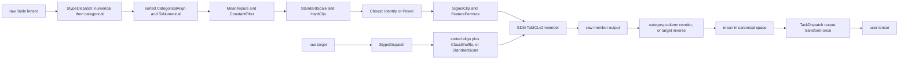

# TabICLv2 stage-wise parity report

This suite compares SDM with `soda-inria/tabicl` at commit
`f719c886a586ed4a29236345e319ac1ea596c478` (`v2.0.0`). Processor classes do
not have to correspond one-to-one; comparisons are made after semantically
equivalent stages. The pinned checkpoint files and digests are:

| Task           | File                                 | SHA-256                                                            |
| -------------- | ------------------------------------ | ------------------------------------------------------------------ |
| Classification | `tabicl-classifier-v2-20260212.ckpt` | `bdc7dbd5e4ff21f8f0456fcf90c6b7cdf72dbea960f2d05b19bec19f9b3d4ed0` |
| Regression     | `tabicl-regressor-v2-20260212.ckpt`  | `0db9cb538f114e79026bf08f45f41ad8dd7ad2de2aaca9a5ca8cd3bd9748ae7a` |

## Integration decisions

The branch starts from current `main`. PR #244 is integrated as its five
focused `CategoricalAlign` commits. PR #230 is not merged wholesale because
its older TargetDispatch/class-inverse design conflicts with the current
output contract. Its default-Recipe and model wiring are retained and adapted
to the current design:

```python
if transformed_target.is_floating_point():
    output = recipe.target.inverse_transform(TableTensor.from_tensor(output))
else:
    output = TableTensor.from_tensor(output, columns=target_categories)
```

Classification never calls `target.inverse_transform`. Every member output is
instead labelled with that fitted member's target categories and explicitly
reordered to the original target categories before aggregation.

Previous work was classified as follows:

| Previous change or test                                           | Current classification                           |
| ----------------------------------------------------------------- | ------------------------------------------------ |
| Recipe/TaskDispatch foundations from #202, #220, #221, #236, #245 | Already merged into `main`                       |
| Categorical vocabulary alignment from #244                        | Still required and integrated                    |
| Default TabICLv2 Recipe/model wiring from #230                    | Still required, adapted                          |
| Per-member fitted Recipe and cache ownership                      | Still required, redesigned on current `Model`    |
| Regression target inverse before aggregation                      | Still required and retained                      |
| Classification inverse through TargetDispatch                     | Obsolete under category-labelled output mapping  |
| Quantile endpoint comparison                                      | Obsolete; the Recipe now uses Power              |
| Analytic ordering/cache/fake-model tests                          | Test-only instrumentation retained               |
| Pinned GPU row/ICL/head hooks                                     | Test-only instrumentation retained               |
| Categorical-before-numerical feature order                        | Intentional positional difference; value-aligned |

## Pipelines

Pinned TabICLv2:

```mermaid
flowchart LR
  A[raw features] --> B[categorical then numerical encoding]
  B --> C[mean impute and constant filter]
  C --> D[standard scale and hard clip -100..100]
  D --> E[identity or Yeo-Johnson power]
  E --> F[two-pass sigma soft clip]
  F --> G[member feature permutation]
  H[raw target] --> I[sorted label encode or standard scale]
  I --> J[member class permutation for classification]
  G --> K[TabICLv2 member]
  J --> K
  K --> L[raw member output]
  L --> M[class gather or regression target inverse]
  M --> N[mean in canonical space]
  N --> O[softmax temperature or identity]
  O --> P[user prediction]
```



SDM:



`Choice` samples independently with replacement, whereas the reference
constructs round-robin normalization groups. This known planning difference
is reported but excluded from execution-parity failures. When an explicit
member Recipe/plan is injected, the semantic execution stages are compared.

The reference also emits encoded categorical features before numerical
features, while SDM retains `StypeDispatch`'s default
numerical-before-categorical route order. This positional difference is
intentional and does not change the transformed value associated with each
feature. Mixed-feature parity checks therefore align by column identity rather
than requiring the same block order.

## Stage contracts

All fitting uses context rows only. Feature transforms then apply to the
combined context/query table.

| Stage                        | Shape and dtype                                                  | State or mapping                                                                           | Aggregation/inversion contract                       |
| ---------------------------- | ---------------------------------------------------------------- | ------------------------------------------------------------------------------------------ | ---------------------------------------------------- |
| Raw features                 | `[N,C_raw]`, mixed SDM blocks                                    | No fitted state                                                                            | Not invertible as a pipeline                         |
| Encoded numerical features   | `[N,C_encoded]`, float32 at model boundary                       | Fitted sorted categorical vocabulary; missing/unseen `-1`; SDM keeps numerical block first | Discrete codes compare after column alignment        |
| Feature pipeline output      | `[N,C_nonconstant]`, float32                                     | Means, retained columns, scale, normalization, sigma bounds                                | Feature-only; no output inverse                      |
| Feature permutation          | `[N,C_nonconstant]`, float32                                     | `output[j]=input[P[j]]`                                                                    | Exact permutation and member order                   |
| Target encoding              | `[N_train]`                                                      | Sorted class vocabulary or original regression target                                      | Exact discrete codes; float tolerance for regression |
| Target transformation        | `[N_train]`                                                      | `new=P[old]` or standardized target                                                        | Categories move with class codes                     |
| Model input                  | features plus target above                                       | Complete explicit member plan                                                              | Float32 comparison at model boundary                 |
| Raw model output             | `[N_test,10]` classification or `[N_test,999]` regression in SDM | Member-local class/target space                                                            | No aggregation yet                                   |
| Original-space member output | `[N_test,K]` or `[N_test,999]`                                   | Category-column reorder or regression inverse                                              | Must run per member                                  |
| Aggregated output            | same canonical shape                                             | Arithmetic mean                                                                            | Canonical logits or original regression target space |
| Output transform             | probabilities or unchanged regression output                     | Stateless resolved TaskDispatch                                                            | Runs once after aggregation                          |
| User prediction              | final tensor                                                     | Classification probabilities; regression 999 coordinates                                   | No additional mapping in `Model`                     |

Processor-specific contracts:

| Processor                          | Input to output                            | Fitted state / randomness                    | Value/order change                                    | Inverse                                     |
| ---------------------------------- | ------------------------------------------ | -------------------------------------------- | ----------------------------------------------------- | ------------------------------------------- |
| `StypeDispatch`                    | mixed table to concatenated routes         | Fitted route processors                      | May change stype; uses its stable default route order | Only for stype-preserving invertible routes |
| `CategoricalAlign(order="sorted")` | categorical codes to fitted codes          | Observed context vocabulary                  | Unknown/missing to `-1`; sklearn-compatible ordering  | None                                        |
| `ToNumerical`                      | categorical block to float numerical block | Stateless                                    | Drops category metadata                               | None                                        |
| `MeanImpute`                       | float table to same                        | Per-column context mean                      | NaN to mean                                           | None                                        |
| `ConstantFilter`                   | `[N,C]` to `[N,C_keep]`                    | Retained context columns                     | Drops constants                                       | None                                        |
| `StandardScale(epsilon=1e-6)`      | float table to same                        | Mean and population standard deviation       | Center/scale                                          | Algebraic inverse                           |
| `HardClip(-100,100)`               | float table to same                        | Stateless                                    | Fixed non-linear clamp                                | None                                        |
| `Choice(Identity,Power)`           | float table to same                        | Global torch RNG selects and fits one option | Optional Yeo-Johnson normalization                    | Delegates to selected inverse               |
| `SigmaClip(4)`                     | float table to same                        | Two-pass mean/std bounds                     | Logarithmic soft clipping                             | None                                        |
| `FeaturePermute`                   | numerical table to same                    | Global torch RNG, stored `P`                 | Exact feature order                                   | Gather by `argsort(P)`                      |
| `ClassShuffle`                     | categorical target to same                 | Global torch RNG, stored `P`                 | `new=P[old]`, categories move                         | Not used for model output                   |
| `TaskDispatch`                     | canonical output to task route             | Resolved while target fits                   | Softmax temperature or identity                       | None                                        |

## Test redesign

| Previous test                                                 | Disposition                                                             |
| ------------------------------------------------------------- | ----------------------------------------------------------------------- |
| Reference plan cardinality, identity member, seed determinism | Still valid                                                             |
| Explicit numeric identity and Power members                   | Still valid                                                             |
| Mixed feature and string-target mismatch characterization     | Sorted vocabularies; route-order difference accepted and column-aligned |
| Quantile endpoint mismatch                                    | Obsolete                                                                |
| TargetDispatch score-head inverse                             | Replaced by category-column reconstruction tests                        |
| Logit-vs-probability, inverse-before-mean, output-once tests  | Still valid                                                             |
| Cache/non-cache member ordering                               | Still valid                                                             |
| Deterministic model orchestration                             | Extended to include feature and output processing                       |
| Pinned core model GPU hooks                                   | Still valid                                                             |
| Pinned single-member E2E classification                       | Updated to avoid target inverse                                         |

The analytic tests use calculated expected values rather than snapshots. They
distinguish logit averaging from probability averaging, nonlinear regression
inverse before/after averaging, nonlinear output before/after averaging,
class mapping direction, repeated cache predictions, and complete deterministic
pre/model/post execution.

## Results

The current focused results are:

- Processor, model orchestration, and TabICLv2 smoke tests: pass on CPU/CUDA.
- Semantic preprocessing and ensemble-plan tests: pass.
- Deterministic fake-model tests: pass.
- Pinned L4 core-model classification/regression tests: pass.
- Pinned L4 single-member end-to-end classification/regression tests: pass.

The first model-internal floating-point divergence remains the completed row
representation. Model inputs, checkpoint bytes, configuration, dtype, device,
and invocation are controlled, and later ICL/head stages do not amplify the
difference. This is consistent with operation/kernel ordering between the
upstream module layout and the SDM port, not a semantic pipeline mismatch.

| Task / checkpoint                     | Maximum absolute difference | Maximum relative difference |
| ------------------------------------- | --------------------------: | --------------------------: |
| Classification row representation     |              `6.4373016e-6` |                `0.00609499` |
| Classification ICL query              |              `5.0663948e-7` |               `0.000398113` |
| Classification 10-way head            |              `3.2186508e-6` |              `1.8825193e-6` |
| Classification active public logits   |              `2.1457672e-6` |              `5.6160286e-7` |
| Regression row representation         |              `8.7022781e-6` |                `0.00690723` |
| Regression ICL query                  |              `3.3378601e-6` |                `0.00164352` |
| Regression 999-way head/public output |              `4.2915344e-6` |              `6.4648239e-6` |

The larger relative values occur at values close to zero; every absolute
difference remains below `9e-6`.

There are no remaining in-scope execution-parity failures for the tested
explicit members. The planning limitation is the intentional `Choice` versus
round-robin difference described above.
