# TabICLv2 stage-wise parity audit

This directory compares the integrated SDM pipeline with `soda-inria/tabicl`
at commit `f719c886a586ed4a29236345e319ac1ea596c478` (`v2.0.0`). It compares
semantic checkpoints rather than assuming that processors map one-to-one.

The integration branch is `rbendias-tabicls-v2-recipe-parity`, based on SDM
`da9bc41bc69a5f430a255e305e0795d4cedfc113`. The checkpoint files are fixed by
content rather than a mutable Hub branch:

| Variant        | File                                 | SHA-256                                                            |
| -------------- | ------------------------------------ | ------------------------------------------------------------------ |
| classification | `tabicl-classifier-v2-20260212.ckpt` | `bdc7dbd5e4ff21f8f0456fcf90c6b7cdf72dbea960f2d05b19bec19f9b3d4ed0` |
| regression     | `tabicl-regressor-v2-20260212.ckpt`  | `0db9cb538f114e79026bf08f45f41ad8dd7ad2de2aaca9a5ca8cd3bd9748ae7a` |

## Integrated PRs and conflict decisions

The dependency-aware integration order was:

1. #202, stype-preserving dispatch inverse.
2. #236, categorical missing-value imputation primitive.
3. #244, fitted categorical vocabulary alignment.
4. #220, task-aware output dispatch.
5. #245, recipe representation correction.
6. #235, categorical target shuffle inverse.
7. #230, TabICLv2 default recipe.
8. #221, model recipe/cache/ensemble orchestration.

| PR   | Result                          | Conflict classification and resolution                                                                                                                                                                                                                                                                                                      |
| ---- | ------------------------------- | ------------------------------------------------------------------------------------------------------------------------------------------------------------------------------------------------------------------------------------------------------------------------------------------------------------------------------------------- |
| #202 | merge `28f5cc0`                 | Clean. Dependency for dispatch inversion.                                                                                                                                                                                                                                                                                                   |
| #236 | merge `19f2407`                 | Clean. Primitive is integrated but deliberately not used by the TabICLv2 default recipe.                                                                                                                                                                                                                                                    |
| #244 | merge `4e77843`                 | Clean. Used before converting categorical codes to numbers.                                                                                                                                                                                                                                                                                 |
| #220 | merge `9a682c4`                 | Syntactic export conflict in `sdm/processing/__init__.py`; resolved as the union of `CategoricalAlign`, `CategoricalImpute`, and `TaskDispatch`. No behavior was selected by the resolution.                                                                                                                                                |
| #245 | merge `b63e72f`                 | Clean.                                                                                                                                                                                                                                                                                                                                      |
| #235 | merge `acd137e`                 | Clean. Establishes score gather direction for class inversion.                                                                                                                                                                                                                                                                              |
| #230 | port `bb5548c`                  | The PR was based on a stale #220 version. Only its final recipe/model delta was ported. Stale tests that inverted a numerical score head through a categorical `StypeDispatch` route were not copied. This is a behavioral compatibility resolution, documented rather than hidden.                                                         |
| #221 | merge `72c907b`, then corrected | The original order was behaviorally wrong: it ran target inverse and nonlinear output processing per member before averaging. Analytic tests demonstrated the error. The corrected order is target inverse per member, aggregation in a canonical space, then final output processing once. Each cache now owns its matching fitted recipe. |

## Pipeline diagrams

### Pinned TabICLv2 reference

```mermaid
flowchart LR
  A[raw train and test features] --> B[TransformToNumerical]
  B --> C[constant feature filter]
  C --> D[standard scale and hard -100..100 clip]
  D --> E[none or power normalization]
  E --> F[two-pass soft outlier clipping]
  F --> G[feature permutation per member]
  H[raw target] --> I[LabelEncoder or StandardScaler]
  I --> J[class permutation for classification]
  G --> K[TabICLv2 member]
  J --> K
  K --> L[raw logits or regression output per member]
  L --> M[class gather or target inverse per member]
  M --> N[mean in canonical logits or original target space]
  N --> O[softmax temperature 0.9 for classification]
  O --> P[normalize probabilities and decode labels]
  N --> Q[requested regression output type]
```



For DataFrames, `TransformToNumerical` places categorical columns before
numerical columns. Its `OrdinalEncoder` uses the fitted sklearn vocabulary and
maps unknown values to `-1`. Non-DataFrame NumPy input is passed through.

### Integrated SDM recipe

```mermaid
flowchart LR
  A[raw TableTensor] --> B[StypeDispatch]
  B --> C[CategoricalAlign then ToNumerical]
  C --> D[MeanImpute]
  D --> E[ConstantFilter]
  E --> F[StandardScale epsilon 1e-6]
  F --> G[Choice Identity or Quantile]
  G --> H[SigmaClip]
  H --> I[FeaturePermute shift]
  J[raw target] --> K[TargetDispatch]
  K --> L[CategoryShuffle or StandardScale]
  I --> M[TabICLv2 member]
  L --> M
  M --> N[raw logits or 999 quantiles per member]
  N --> O[target inverse per member]
  O --> P[mean in canonical logits or original target space]
  P --> Q[TaskDispatch]
  Q --> R[Softmax temperature 0.9 or Identity]
  R --> S[user-facing tensor]
```



`Choice` intentionally draws independently with replacement from the global
PyTorch CPU generator. It does not reproduce the reference's round-robin
normalization groups. This is the explicitly accepted ensemble-plan
divergence. The harness therefore compares independently generated plans and
also injects one exact precomputed member plan into both pipelines.

## Observable stage contract

Every snapshot records shape, dtype, values when representable, columns, and
discrete metadata. Discrete mappings, member order, permutations, and metadata
use exact equality. Floating-point comparison starts at exact equality and
uses a nonzero tolerance only where the measured source is documented below.

| Observable stage            | Shape and dtype                                                                                                                  | Mapping and fitted state                                                                                                                                                                                                |
| --------------------------- | -------------------------------------------------------------------------------------------------------------------------------- | ----------------------------------------------------------------------------------------------------------------------------------------------------------------------------------------------------------------------- |
| raw feature input           | `[N_train + N_test, C_raw]`; pandas may be mixed/object, SDM uses stype-specific blocks                                          | No fit. Original values before either implementation's encoding.                                                                                                                                                        |
| encoded numerical features  | same row count; reference `float64`, SDM normally `torch.float32`; `C_encoded` may reorder/drop unsupported columns              | Reference: fitted sklearn ordinal vocabulary, categorical block first. SDM: fitted `CategoricalAlign` vocabulary, numerical block first after `StypeDispatch`. Unknown SDM categories and missing codes remain `-1`.    |
| feature pipeline output     | `[N_all, C_nonconstant]`; reference `float64`, SDM `float32`                                                                     | Mean imputation, fitted constant selection, scaling, normalization choice, and outlier processing have completed.                                                                                                       |
| feature permutation         | `[N_all, C_nonconstant]`, same dtype as preceding stage                                                                          | Exact gather `output[..., j] = input[..., P[j]]`; columns move with values.                                                                                                                                             |
| target encoding             | `[N_train]`; sklearn `int64` or `float64`, SDM categorical `int32/int64` or numerical `float32`                                  | Classification maps labels to codes; regression remains in original target space at this semantic checkpoint.                                                                                                           |
| target transformation       | `[N_train]`                                                                                                                      | Classification `new_code = P[old_code]`; regression `(y - mean) / scale`.                                                                                                                                               |
| final model input           | features `[N_all, C_model]` in `float32`; target `[N_train]`, reference classification is passed as float and SDM as integer     | Includes the injected feature/class member plan. Feature values are compared after both implementations cast to model dtype.                                                                                            |
| raw model output per member | classification `[N_test, K_active]` in reference and `[N_test, 10]` before SDM truncation; regression `[N_test, 999]`; `float32` | Checkpoint output in member-local class/target space. Member index and output type are metadata.                                                                                                                        |
| output after target inverse | classification `[N_test, K_active]`; regression preserves the requested output tail                                              | Classification `canonical[..., old] = raw[..., P[old]]`; regression `raw * target_scale + target_mean`.                                                                                                                 |
| aggregated output           | same shape as canonical member output                                                                                            | Arithmetic mean. Space is exactly `canonical_logits` for classification and `original_target` for regression.                                                                                                           |
| final output postprocessing | classification probabilities; regression unchanged in the current SDM recipe                                                     | Classification applies `softmax(canonical_logits / 0.9)` once after averaging.                                                                                                                                          |
| user-facing prediction      | SDM returns the final tensor                                                                                                     | Classification currently returns probabilities rather than decoded labels. Regression currently returns 999 inverse-scaled quantile coordinates; the sklearn wrapper instead exposes mean/median/quantile output types. |

## Integrated processor contracts

`N` is the row count, `C` the current column count, and `K` the number of
classes. All fitting uses context/train rows only. Feature processors operate
on the whole train+query table after fitting.

| Processor                             | Input to output                                                                    | Fitted state and random-state owner                                                                  | Value/order/space change                                                                                     | Inverse and aggregation rule                                                                                                                                                                                             |
| ------------------------------------- | ---------------------------------------------------------------------------------- | ---------------------------------------------------------------------------------------------------- | ------------------------------------------------------------------------------------------------------------ | ------------------------------------------------------------------------------------------------------------------------------------------------------------------------------------------------------------------------ |
| `StypeDispatch`                       | mixed `TableTensor [N,C]` to concatenated route outputs                            | Fits every non-empty configured route; no RNG                                                        | Concatenates route outputs in configured stype order, so it may change stype, count, and order               | Generic inverse only for stype-preserving routes. The recipe's categorical-to-numerical route is not inverted.                                                                                                           |
| `CategoricalAlign`                    | categorical codes `int32/int64 [N,C_cat]` to aligned codes of the same shape/dtype | Stores context-observed category values in first-observation order; no RNG                           | Local category value maps to fitted vocabulary index; missing or unseen maps to `-1`                         | Not invertible; original query vocabulary is not retained.                                                                                                                                                               |
| `ToNumerical`                         | numerical/categorical blocks to one floating numerical block                       | Stateless                                                                                            | Casts category codes to numerical dtype and appends them after existing numerical columns; `-1` is preserved | Not invertible; category metadata is discarded.                                                                                                                                                                          |
| `MeanImpute`                          | float-like `[N,C]` to same                                                         | Per-column context mean; all-NaN uses `0`; no RNG                                                    | NaN becomes fitted mean                                                                                      | Not invertible because missing positions are not retained.                                                                                                                                                               |
| `ConstantFilter`                      | `[N,C]` to `[N,C_keep]`                                                            | Stores context column names with more than one unique value; no RNG                                  | Drops and therefore reorders only through selection                                                          | Not invertible; dropped values are unavailable.                                                                                                                                                                          |
| feature `StandardScale(epsilon=1e-6)` | float `[N,C]` to same                                                              | Context mean and population std plus epsilon; no RNG                                                 | `(x - mean) / scale`; values and target space change                                                         | Algebraically invertible, but unused on the feature inverse path. Reference additionally hard-clips this stage to `[-100,100]`.                                                                                          |
| `Choice`                              | delegates `[N,C]` to one option                                                    | Global PyTorch CPU RNG chooses one option during each member fit; selected option owns its own state | Current default is `Identity` or nonlinear `Quantile`                                                        | Inverse delegates only when the selected option is invertible. Feature-only; no output aggregation interaction.                                                                                                          |
| `Identity`                            | same shape/dtype/values                                                            | Stateless, no RNG                                                                                    | None                                                                                                         | Exact inverse; commutes with every operation.                                                                                                                                                                            |
| `Quantile`                            | float `[N,C]` to same                                                              | Fitted quantiles; its subsampling generator owns `random_state=0`                                    | Nonlinear marginal map, normally to a normal distribution                                                    | Nonlinear inverse; feature-only. It is not the reference default `PowerTransformer`.                                                                                                                                     |
| `SigmaClip(threshold=4)`              | float `[N,C]` to same                                                              | Two-pass context mean/std and bounds; no RNG                                                         | Nonlinear logarithmic soft clipping                                                                          | Not invertible. This semantically corresponds to reference `OutlierRemover`.                                                                                                                                             |
| `FeaturePermute(shift)`               | numerical `[N,C]` to same                                                          | Global PyTorch CPU RNG owns the cyclic offset; stores `P`                                            | `output[j] = input[P[j]]`; exact column-order change                                                         | Inverse gathers by `argsort(P)`. Feature-only.                                                                                                                                                                           |
| `TargetDispatch`                      | one raw target column to selected route                                            | Fitted raw stype selects classification or regression and persists that task; no RNG itself          | Owns the complete model-head inverse even though the head is numerical                                       | Mandatory before aggregation. It prevents a classification score head from being misrouted as regression merely because logits are numerical.                                                                            |
| `CategoryShuffle(shift)`              | categorical target `[N,1]` to same                                                 | Global PyTorch CPU RNG owns offset; stores forward permutation `P` and class count                   | Forward target mapping is `new=P[old]`; category metadata moves so decoded training labels remain stable     | Model-score inverse is `canonical[old]=raw[P[old]]` and drops inactive trailing head entries. Linear gather commutes with averaging only if every member has the same `P`; therefore each member is canonicalized first. |
| target `StandardScale()`              | numerical target `[N,1]` to same                                                   | Context target mean and population scale; no RNG                                                     | Maps original target to standardized model space                                                             | `y=model_y*scale+mean`. Affine inverse mathematically commutes with a mean, but the generic contract always inverses per member; a nonlinear target inverse does not commute.                                            |
| `TaskDispatch`                        | numerical aggregated output to selected output route                               | Target fit resolves task; routes must be stateless; no RNG                                           | Classification selects softmax, regression selects identity                                                  | No inverse. Runs exactly once after aggregation.                                                                                                                                                                         |
| `SoftmaxTemperature(0.9)`             | logits `[...,K]` to probabilities, float                                           | Stateless                                                                                            | Nonlinear `softmax(x/0.9)`                                                                                   | Not invertible and does not commute with averaging. Probability averaging and logit averaging are observably different.                                                                                                  |

The complete execution order implemented by `BaseModel` is:

1. Deep-copy one recipe per ensemble member.
2. Fit each member feature recipe on context rows and transform all rows.
3. Fit/transform that member's target.
4. Invoke the model and retain member order.
5. Run that same member recipe's target inverse.
6. Stack canonical member outputs in creation order and take their mean.
7. Run the first member's resolved stateless output pipeline once.
8. For `fit`/`predict`, retain one frozen cache and its matching fitted recipe
   per member; replay preserves member order.

## Ensemble-plan contract

Each `EnsembleMemberPlan` records member index, normalization, feature
permutation, class permutation, target transformation, processor seed owners,
model output type, and aggregation space. Plans generated with the same seed
are exactly repeatable within each implementation. Different seeds produce a
different canonical member set when enough permutations exist.

Reference plan generation may return fewer members than requested. With eight
requested estimators, the measured counts are:

| Task/configuration                        | Actual reference members |
| ----------------------------------------- | -----------------------: |
| binary classification, one feature        |                        4 |
| three-class classification, one feature   |                        6 |
| regression, one feature                   |                        2 |
| three-class classification, four features |                        8 |
| regression, four features                 |                        8 |

With one requested estimator, both reference tasks use `none`, identity
feature order, and (for classification) identity class order. Reference config
group iteration uses set-derived normalization groups, so cross-process raw
member order can depend on `PYTHONHASHSEED`; the harness additionally compares
stable semantic member IDs.

## Test data and analytic oracles

`datasets.py` provides deterministic cases for binary and three-class
classification, string and non-contiguous labels, mixed features, numeric and
categorical missing values, unknown query categories, constants, outliers, one
feature, more features than members, positive/negative regression targets,
constant and near-constant targets, and strongly skewed targets.

The fake model does not produce snapshots derived from SDM. Its expected
values are analytical and encode member identity in the output. It verifies:

- exact feature and target permutation reaching each member;
- forward and inverse class-permutation direction;
- class inverse before aggregation;
- logit averaging rather than probability averaging;
- nonlinear target inverse before aggregation (`exp(mean(log y))` is rejected
  in favor of `mean(exp(log y))`);
- nonlinear final output exactly once after aggregation;
- matching fitted recipe per cache;
- cache/non-cache equivalence and repeated prediction;
- positive estimator count.

The logit-vs-probability oracle previously failed by maximum absolute
`0.0529906265` and relative `0.61410743`. The wrong nonlinear output placement
returned `5` instead of the analytical answer `4`. Replaying every cache with
the last fitted feature plan produced a maximum absolute feature error of
`20`. These three failures now pass after the localized `BaseModel` and
`TargetDispatch` corrections.

## Differential results

### Preprocessing

For an injected numeric `none` member with an exact feature permutation, the
first difference is the encoded-feature dtype (`float64` reference versus
`float32` SDM). At the actual float32 model boundary, columns, shape, target
shape, and target dtype match for regression. The remaining value difference
is maximum absolute `1.1920928955078125e-7` and maximum relative
`7.519868997866162e-8`; the test uses `atol=2e-7`, `rtol=1e-7`.

An explicit SDM `Power` member follows the same reference semantic steps. Its
float32 lambda optimization differs from sklearn's float64 optimizer by max
absolute `1.856088638305664e-4` and max relative
`3.295467759016901e-4`. The default integrated recipe does not select this
member: it selects `Identity` or `Quantile`, whereas the reference default is
`none` or `power`.

Forcing the default `Quantile` option against an explicit reference quantile
member exposes an endpoint-constant difference: maximum absolute
`0.03275918960571289` and maximum relative `0.006300646811723709`. This is a
characterized mismatch, not a relaxed all-close tolerance.

Mixed categorical input diverges at the encoded-feature checkpoint for three
separate reasons:

1. Reference order is categorical then numerical; SDM is numerical then
   categorical.
2. sklearn sorts the fitted string vocabulary; SDM retains first observation.
3. In an object column, a fitted Python `None` is a regular sklearn category,
   while `TableTensor` represents it as missing code `-1`. Both pipelines map
   a genuinely unseen query value to `-1`.

String target encoding has the same sorted-versus-first-observation
difference. Injecting the same index permutation is therefore not enough to
inject the same semantic label permutation unless the vocabulary is aligned.

### Pinned GPU model

GPU tests ran on an NVIDIA L4 in FP32 with AMP and FA3 disabled, GPU offload,
identical checkpoint bytes, identical model configuration, and semantically
identical inputs. The two implementations use different module layouts, so
the comparable internal checkpoints are completed row representation,
normalized ICL query representation, and decoder/head output.

| Task/stage                        |        Maximum absolute |         Maximum relative |
| --------------------------------- | ----------------------: | -----------------------: |
| classification row representation | `6.4373016357421875e-6` |  `0.0060949851758778095` |
| classification ICL query          |  `5.066394805908203e-7` | `0.00039811345050111413` |
| classification 10-way head        | `3.2186508178710938e-6` |  `1.8825193137672613e-6` |
| classification active raw logits  | `2.1457672119140625e-6` |    `5.61602860216226e-7` |
| regression row representation     |  `8.702278137207031e-6` |   `0.006907229777425528` |
| regression ICL query              |  `3.337860107421875e-6` |  `0.0016435239231213927` |
| regression 999-way head           |  `4.291534423828125e-6` |   `6.464823854912538e-6` |

Large relative errors occur only around values close to zero; absolute errors
remain below `9e-6`. The first model-internal divergence is the row
representation. Because inputs, state dict, config, dtype, device, and public
invocation semantics are controlled, the likely cause is floating-point
operation/kernel ordering between the upstream PyTorch modules and the SDM
port. Later stages do not amplify it materially.

Real SDM cache versus non-cache maximum differences are `2.384185791015625e-6`
for classification and `3.814697265625e-6` for regression. Repeated prediction
and repeated fit with the same inputs are bitwise equal to the first cached
result.

## Unresolved semantic decisions

These are deliberately not silently resolved:

1. **Default normalization:** #230 uses random `Identity/Quantile`; pinned
   TabICLv2 uses grouped `none/power`. The random-with-replacement selection is
   an accepted intentional deviation, but whether `Quantile` should become
   `Power` is still a recipe-owner decision.
2. **Categorical column order:** a TabICLv2 adapter could request categorical
   before numerical without changing the generic `ToNumerical` default used by
   future RFM or TabPFN recipes.
3. **Vocabulary order:** exact parity requires a sorted/LabelEncoder-compatible
   vocabulary policy for both feature categories and targets. Sorting is not
   universally valid for mixed incomparable Python values, so this should be
   an explicit policy rather than a global default.
4. **Missing `None`:** decide whether Python `None` in object columns is a
   category (the pinned sklearn behavior) or missing (the current TableTensor
   behavior). Unknown values are already consistently `-1`.
5. **Hard scale clipping:** the reference `CustomStandardScaler` hard-clips to
   `[-100,100]`; the SDM recipe contains a TODO and omits it. `SigmaClip` is a
   separate later semantic step and matches reference soft outlier clipping.
6. **Regression API:** the core SDM model exposes 999 inverse-scaled quantile
   coordinates. The sklearn reference supports mean, median, variance, and
   selected quantiles through its quantile-distribution adapter. The intended
   SDM user-facing output contract is not yet specified.
7. **Classification API:** SDM returns probabilities; sklearn `predict`
   decodes class labels. Label decoding should remain an API/driver concern or
   become an explicit output processor, but it must use the fitted vocabulary.
8. **Reference variance:** the pinned upstream regression variance inverse path
   should be treated cautiously; variance does not transform like a location
   under target scaling. Do not encode that behavior as a generic pipeline
   contract without a separate decision.

## Minimal remediation plan

The already implemented generic corrections are the minimal set needed to fix
the observed orchestration root cause:

| Change                                         | Classification                                                      | Regression                                    | Category                     |
| ---------------------------------------------- | ------------------------------------------------------------------- | --------------------------------------------- | ---------------------------- |
| one deep-copied fitted recipe per member/cache | fixes member-plan and cache-order failures                          | fixes member-specific target state            | generic pipeline correctness |
| target inverse per member before mean          | fixes class direction/canonical-space failures                      | fixes nonlinear target inverse placement      | generic pipeline correctness |
| output processor once after mean               | fixes logit-vs-probability averaging and nonlinear output placement | prevents future nonlinear output misplacement | generic pipeline correctness |
| `TargetDispatch` owns full score-head inverse  | fixes numerical-logit misrouting and truncation                     | retains numerical target route                | generic task-aware adapter   |

Remaining parity work, in dependency order, is:

1. Add an explicit model recipe plan interface so a precomputed member plan can
   be supplied without mutating processor internals. Keep SDM `Choice` random
   behavior as the known intentional deviation.
2. Decide #230's normalization semantics. If exact pinned defaults are wanted,
   use generic `Power()` rather than `Quantile()` in the TabICLv2 recipe and
   preserve the measured optimizer tolerance. This is TabICLv2 recipe-specific
   and need not affect RFM/TabPFN.
3. Add parameterized categorical ordering and vocabulary policies, then select
   categorical-first and sklearn-compatible sorted vocabularies only in the
   TabICLv2 adapter. This resolves the mixed-feature and target-code failures
   without model-specific logic in `TableTensor`.
4. Add the generic hard `Clip(-100,100)` step after feature standard scaling in
   this recipe. This resolves extreme-value input failures and is a
   TabICLv2-specific composition of a generic processor.
5. Define a generic distribution-output protocol and a TabICLv2 quantile
   adapter for mean/median/variance/selected quantiles. This is a model-output
   adapter, not preprocessing coupling.

Items 2 through 5 should not be implemented until the unresolved API/recipe
choices above are accepted. The pinned core model itself does not need an
architectural fix: its measured outputs are already equivalent within the
strict FP32 tolerances justified above.

## Running the audit

The reference package must resolve to the pinned source checkout. CPU plan,
processor, and analytic tests:

```bash
.venv/bin/python -m pytest \
  test/integration/tabiclv2_parity/test_plan_and_stages.py \
  test/models/test_recipe_ensemble.py \
  test/processing/test_target_dispatch.py -q
```

Pinned-checkpoint GPU tests are opt-in and never download implicitly:

```bash
SDM_RUN_TABICLV2_GPU_PARITY=1 \
  .venv/bin/python -m pytest \
  test/integration/tabiclv2_parity/test_gpu_checkpoint.py -q
```

If the checkpoint is not already in the Hugging Face cache, set
`TABICLV2_CLASSIFICATION_CHECKPOINT` and `TABICLV2_REGRESSION_CHECKPOINT` to
local files. Their SHA-256 values must match the table above.
